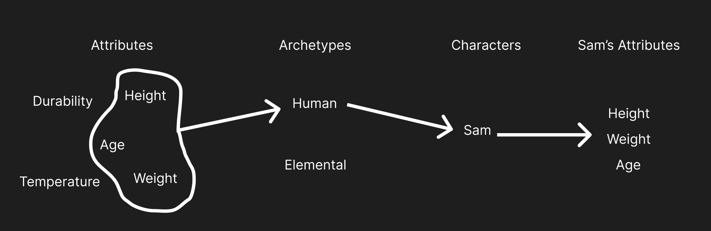
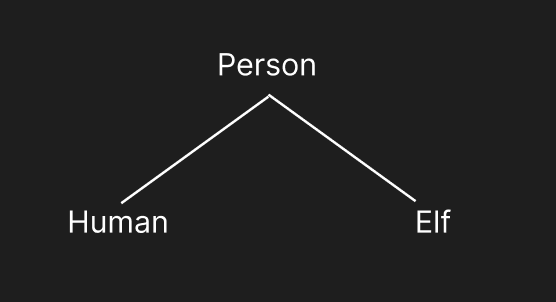
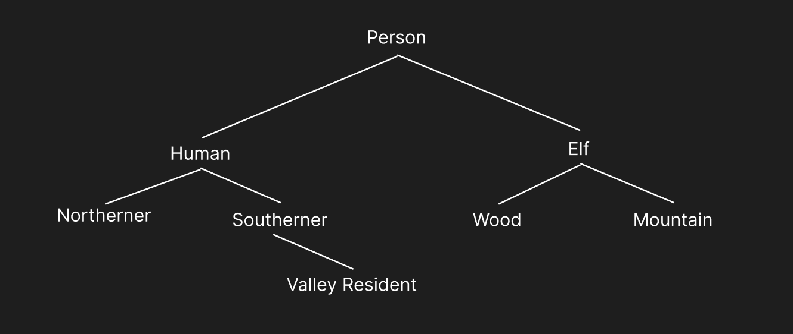

# Archetypes

Simply put, archetypes are sets of attributes that can be assigned to characters and creatures.

With this in mind, archetypes can be used to group characters and creatures into whatever categories is appropriate for your game. They can represent species, occupations, factions, citizenship, monster type or nearly anything else.

## Characters vs Creatures

When creating a new archetype, you will choose if the type of entity created from that archetype is a character or a creature.

Character archetypes represent types of characters in your game, both playable and non-playable.

Creature archetypes fill your ruleset's bestiary, allowing for the creation of individual monsters in connected virtual tabletops.

:::info
Players of your game will only be able to create playable characters from character archetypes.
:::

## Assigning Attributes

Other than making character and creature creation possible, the main purpose of archetypes is to collect attributes which can be assigned to entities created from them.

For example, a Human archetype might have attributes to represent height, weight and age. Any character which has the Human archetype will receive their own copy of these attributes, which can then be [controlled with their sheet](./attributes/automating-sheets.md).

## Archetypal Inheritence

It's common for archetypes to share large sets of attributes. For example, a Human archetype and an Elf archetype might share attributes for height, weight and age, while still having their own unique attributes.

Rather than individually assigning the same attributes to each archetype, you can create a parent archetype which contains all of the shared attributes, and then have the Human and Elf archetypes inherit from it.

In this example, every attribute assigned to Person will also be assigned to Human and Elf. Inherited attributes act the same way as ones assigned directly to an attribute.

:::info
While two archetypes might share an attribute, it could be that the minimum and maximum values, as well as their defaults, are different. Elves, for example, might be taller than humans by default. You can modify the values of inherited attributes for each archetype.
:::

Archetypal inheritence makes it easy to have _subclasses_ of archetypes. Each with variations on the attributes they share.

