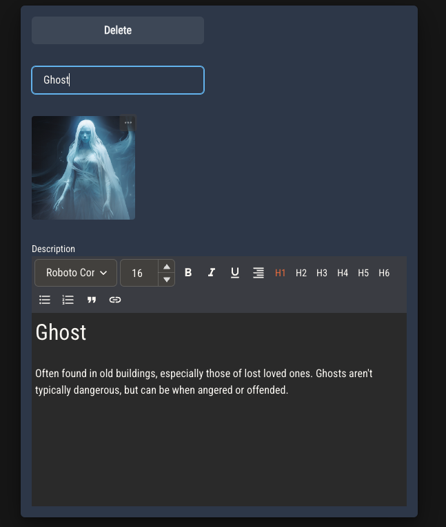
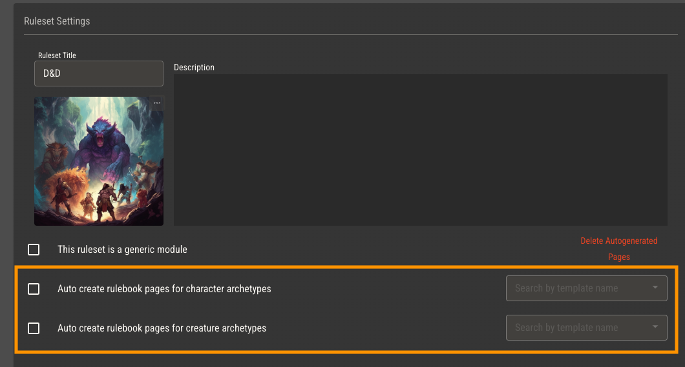
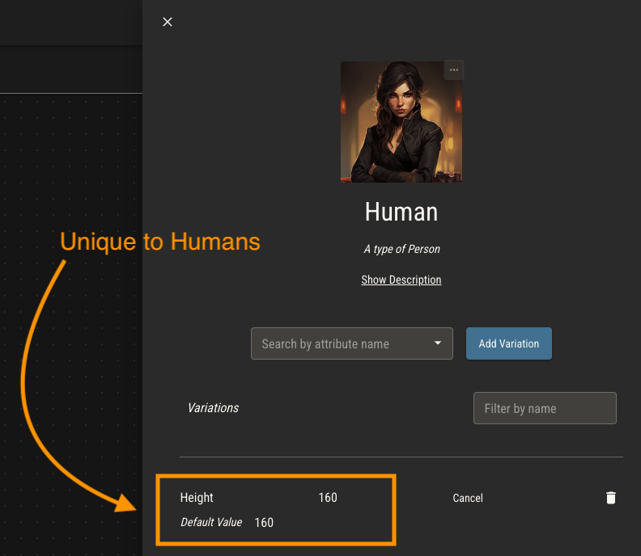
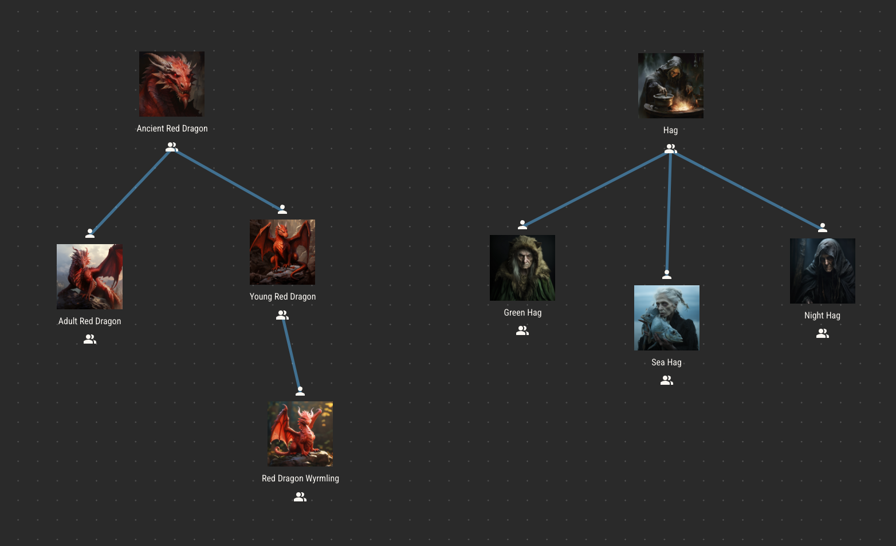

# Archetypes

Simply put, archetypes are sets of attribute variations that can be assigned to characters and creatures.

With this in mind, archetypes can be used to group characters and creatures into whatever categories are appropriate for your game. They can represent species, occupations, factions, citizenship, monster type or nearly anything else.

To create a new archetype, drag the archetype component from the side panel. Use other components on this page to decorate the archetype view for easier organization.

## Characters vs Creatures

Character archetypes represent types of characters in your game, both playable and non-playable.

Creature archetypes fill your ruleset's bestiary, allowing for the creation of individual monsters within worlds.

:::info
Players of your game will only be able to create playable characters from character archetypes.
:::

Quest Bound can optionally create a new rulebook page for you every time an archetype is created. To enable this, select page templates in the ruleset settings. These templates can use variables
to inject details about the archetype into the page. Read more about page variables [here](./rulebook#variables).

## Attribute Variations

Other than making character and creature creation possible, the main purpose of archetypes is to collect attribute variations which can be assigned to entities created from them.

Suppose you have attributes to represent the physical characteristics of people in your ruleset, such as height, weight and hair color. Every character created from your ruleset will
have these attributes with their default values.

Your ruleset might have a type of person which is, by default, much taller than everyone else. You can create an archetype for this type of person and add a variation to their height attribute, setting
a higher default value. Every character that has this archetype will get that default value for height instead.

## Archetypal Inheritence

It's common for archetypes to share large sets of attribute variations. For example, a Human archetype and an Elf archetype might share attributes for height, weight and age, while still having their own unique attribute variations.

Rather than individually assigning the same attributes to each archetype, you can create a parent archetype which contains all of the shared attributes, and then have the Human and Elf archetypes inherit from it.

In this example, every attribute variation assigned to Person will also be assigned to Human and Elf. Inherited attributes act the same way as ones assigned directly to an attribute.

Archetypal inheritence makes it easy to have _subclasses_ of archetypes. Each with variations on the attributes they share.

Archetypes will first look to their direct parent for a variation, then their grandparent, and so on. If there is no variation found, the archetype will use the default value of the attribute.

To assign an archetype to a parent, start dragging a connection from the parent's inheritance icon below its image. An icon above all archetypes will appear, allowing you to connect the line to a child. Archetypes may only have one parent, but they
may have any number of children.

