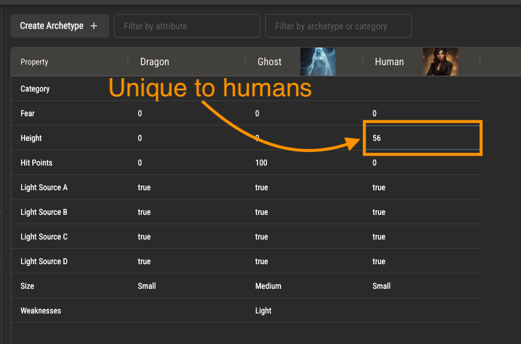

# Archetypes

Simply put, archetypes are sets of attribute variations, specifically variations to attribute default values.

You can use archetypes to group any concept of entities together, like a bestiary or set of character classes.

## Attribute Variations

Suppose you have attributes to represent the physical characteristics of people in your ruleset, such as height, weight and hair color. Every character created from your ruleset will
have these attributes with their default values.

Your ruleset might have a type of person which is, by default, much taller than everyone else. You can create an archetype for this type of person and add a variation to their height attribute, setting
a higher default value. The variation will be the default value of that attribute for that archetype.

## Assigning Archetypes to Rulebook Pages

An archetypes may be assigned to rulebook page through the page settings. Text replacement, dynamic image and description assignements will all reference
an assigned archetype, including its attribute variations.

Quest Bound can optionally create a new rulebook page for you every time an archetype is created. To enable this, select page templates in the ruleset settings. These templates can use variables
to inject details about the archetype into the page. Read more about page variables [here](./rulebook#variables).
