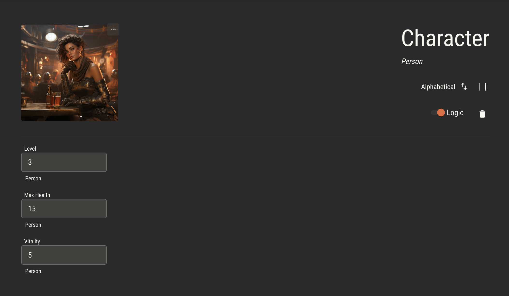

# Automating Sheets

## Simple Sheets

Adding logic to an attribute will automate sheets by default. In our [example](./logic.md), Max Health is equal to a character’s vitality multiplied by its level. A simple character sheet will look like this.

:::info
Attributes with logic will recalculate their values whenever any of their associated attributes change.

As you update either the Vitality or the Level fields, the Max Health field will recalculate its value by multiplying them together, then update automatically.
:::

While attributes with logic will update automatically, the player might need to override the derived value at any time, such as in response to an improvised rule during gameplay.

When an automated attribute is updated manually, it will disable its logic. An option to reenable its logic will appear in the field.

## Custom Sheets

### Controlling Attributes

Input and checkbox components may be used to control a character's attributes. When an attribute is assigned to a component, it will act as the control for that attribute in the same way the simple sheet does.

:::caution
Make sure to use the right component for the attribute type!

Boolean attributes may only be assigned to checkboxes. Number and text attributes should have the correct corresponding input type.
:::

### Reading Attributes

Text components which are assigned attributes will display the value of that attribute for the character.

### Conditional Rendering

Any component may be set to rendner _only if_ a given boolean attribute is true or false. By layering components, you can set up complex, dynamic sheets
which change based on the state of the character.

