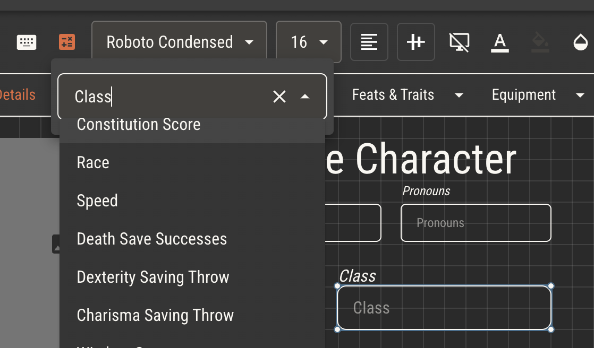
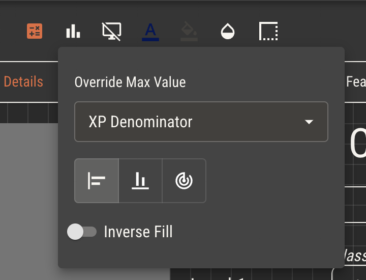
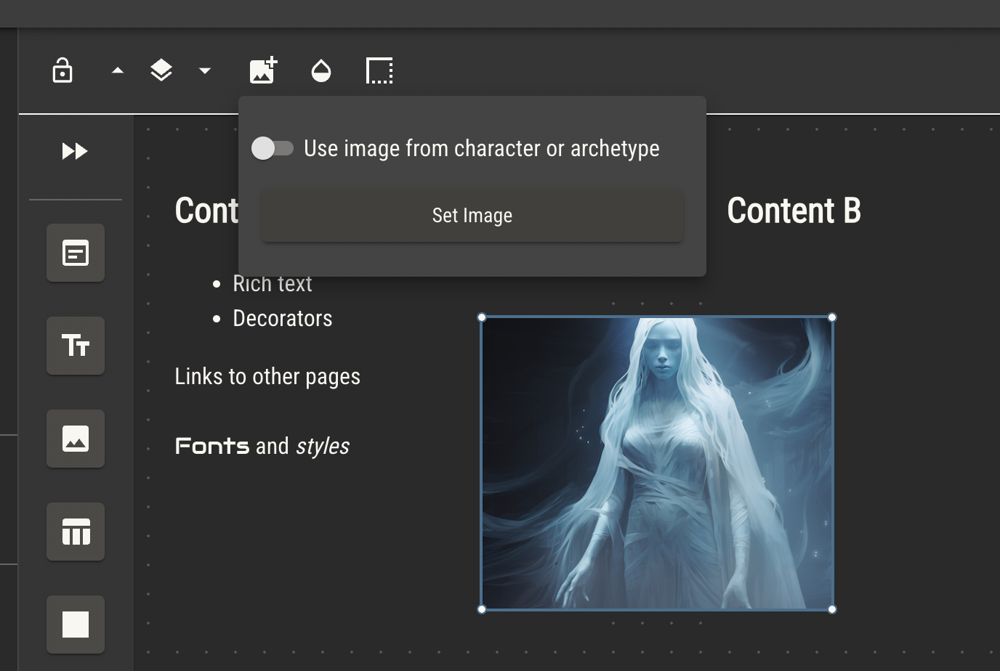
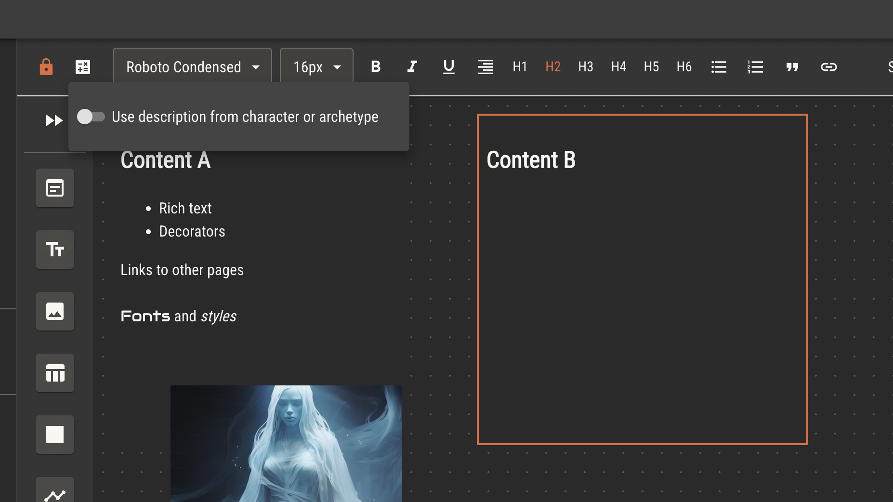

# Controlling Attributes In Game

When your players make a character from your game, that character gets a copy of every attribute in your ruleset. The player needs to be able to control those attributes, viewing and updating them for the lifetime of that character.

## Simple Sheets

All characters come with a simple character sheet. The simple sheet will have a field for every attribute in the ruleset. Those fields will be appropriate for the attribute type.

## Custom Sheets

When a player makes a character, they have the option of selecting one of the ruleset's [sheet templates](../sheet-templates.md). As the creator of that template, you can choose which fields control attributes.

### Controlling Attributes

Certain components have an option in their toolbar for attribute assignment. Components that are controlled by the player in game, like inputs and checkboxes, will let players control those attributes.

:::info
Boolean attributes may only be assigned to checkboxes. A check indicates a value of _true_, while unchecked represents _false_.
:::

### Reading Attributes

Text and graph components may also be assigned attributes. Unlike inputs and checkboxes, these components will only read attribute values, not update them.

Text components which are assigned an attribute will display its value. For number attributes, there is an option to always display the appropriate mathematical sign.

Graph components display a percentage of an assigned attribute's current value over its maximum value, or that of one attribute's value over another.

### Text Replacement

You can reference the value of any attribute, or any attribute's maximum value, with text replacement.

When placing the name of an attribute within double curly brackets, `{{Attribute Name}}`, the value of that attribute will replace that text. The use the maximum value, add `:max` to the end of the attribute name. `{{Attribute Name:max}}` This can be done in most places where text is freely placed, including text and notes components.

### Built In Variables

Image components can pull their own image from the character's portrait or, for [rulebook pages with assigned archetypes](../rulebook.md), the archetype's image.

A similar option exists on content components to inject an archetype’s description.

Within such a page, `{{name}}` will inject the archetype's name without any additional attribute creation.
