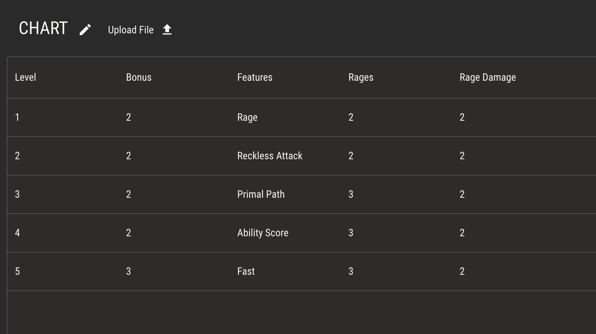

# Automating Attributes with Logic

As described in [Intro to Attributes](./attributes.md), attributes are variables assigned to entities like characters. Every character has its own copy of attributes which can be controlled from its sheet.

When playing a TTRPG with pen and paper, players are expected to manually update the attributes on their character sheets, erasing and rewriting values as they're updated. Sheets in Quest Bound give the same control to players. For every attribute in your ruleset, you can add a field to a sheet which allows players to manually update the value of that attribute.

## Derived Values

Suppose you have a number attribute called Max Health. In your game, Max Health is always the value of another number attribute, Vitality, multiplied by a third attribute, Level.

> Max Health = Vitality x Level

In this example, Level and Vitality are controlled by the player based on the rules of your game. Max Health, however, is _derived_ from the values of Level and Vitality. It's not something the player should need to change manually.

You can build this automation directly into the Max Health attribute using its logic.

:::caution
Logic can quickly become complex! For best results, keep it simple and only add logic when automation will greatly benefit your players. Remember, we’re making tabletop games, not video games.
:::

## Visual Programming

The logic editor of an attribute is a type of node editor which allows for visually programming simple instructions. While there are only a handful of operations available, chaining them together allows for _very_ complex instruction sets.

:::tip
If you’re new to programming concepts, logic can feel overwhelming. Keeping it simple and experimenting will help.

Add a Quest Bound official ruleset to your shelf and check out the logic of several components to get an idea of how it works.
:::

## Key Points

There are a few key points to understand about the logic editor before wiring up your first attribute.

1. Every logic node takes an input and produces an output
2. Outputs are passed down a chain of connected nodes, with operations applied to the accumulated value
3. The last node in a series of chained nodes provides the result of that chain’s calculation

4. Mathematical order of operations is not recognized. Operations flow down the chain of connected nodes left to right
5. Logic always starts with the default value node. If an operation is not connected to default value in some way, it will not be considered in the calculation

## Logic Nodes

Below are the types of logic nodes available

### Primitives

- Number
  - Provides a single number
- Text
  - Provides a word or string of words
- Boolean
  - Provides a boolean value, true or false

### Operations

- Set
  - Applies to result of its output chain to its input (i.e. the default value)
- Add
  - Adds its input to its output
- Subtract
  - Subtracts its output from its input
- Multiply
  - Multiplies its input and output values
- Divide
  - Divides its input by its output
- Round
  - Considers its input.
  - If its a number with a floating point decimal greater than or equal to 0.5, it will round its output up to the nearest whole number.
  - If its a number with a floating point decimal less than 0.5, it will round its output down to the nearest whole number.
- Round Up
  - Rounds its input up to the nearest whole number and provides that as its output
- Round Down
  - Rounds its input down to the nearest whole number and provides that as its output

### Comparisons

When comparison nodes are attached to a condition, they will evaluate the nodes in their chain to be either true or false.

:::tip
When a comparison node is in a chain, the result of that chain will always be either true or false.
:::

- Equal
  - Resolves to true if its input and output are the same value
- Not Equal
  - Resolves to true if its input and output are not the same value
- Greater Than
  - Resolves to true if its input is greater than its output
  - _This only works for number types_
- Less Than
  - Resolves to true if its input is less than its output
  - _This only works for number types_
- Greater Than or Equal
  - Resolves to true if its input is greater than or equal to its output
  - _This only works for number types_
- Less Than or Equal
  - Resolves to true if its input is less than or equal to its output
  - _This only works for number types_

### Conditions

- If
  - Splits logic into two possible branches based on the result of a comparison
  - If the comparison chain resolves to true, it passes its input to the true branch
  - If the comparison chain resolves to false, it passes its input to the false branch
    
- And
  - Connects multiple condition chains
  - Resolves to true if **all** connected chains resolve to true
    
- Or
  - Connects multiple condition chains
  - Resolves to true if **any** connected chain resolves to true
    

### References

- Attribute

  - Reads the default value of another attribute and provides it as output
  - Inserts a field in the test panel to change the value of the attribute
  - On a sheet, this will take the value of that entity’s (character, creature, etc) attribute, not the default value
    

- Chart
  - Reads a value from a chart and provides it as output
  - Chart nodes have one input, one output, and two connection points to filter the chart
  - Attach a text node to the column connection point to describe from which _column_ to read the output value
  - Attach a comparison chain to the filter connection point to describe from which _row_ to read the output value
  - The below chart node can be read like this: “Select from the Features column, reading the row where the value in the Level column is equal to this character’s level.”
    
  - The node will scan the provided chart, providing the **first** instance where the filter comparison evaluates to true.
  - If the character’s level is 1, it will provide the text “Rage” as its output
    
