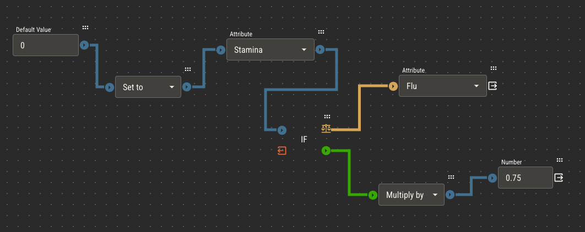
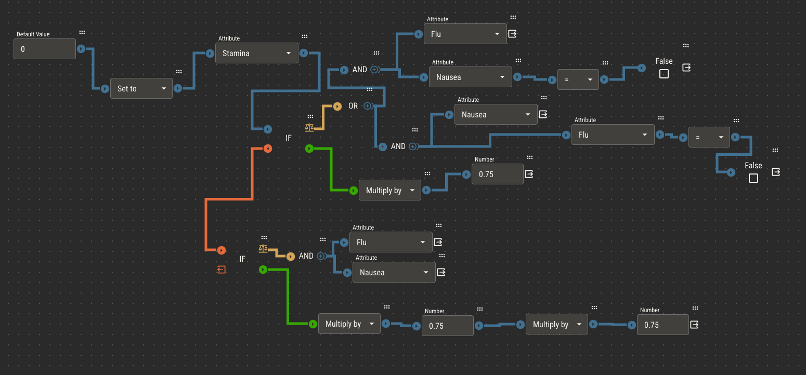
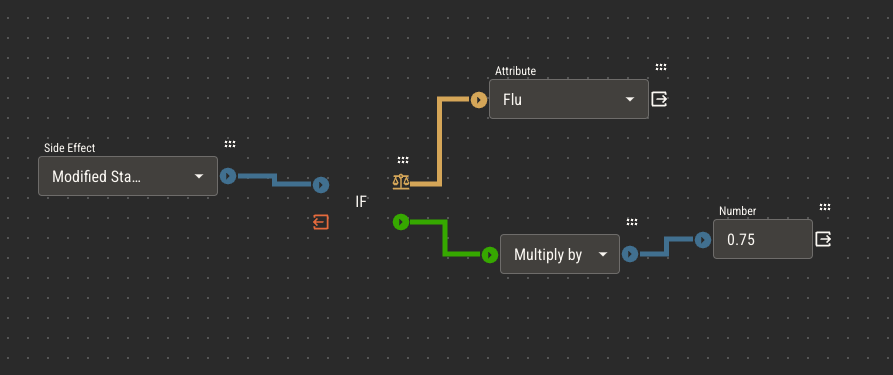
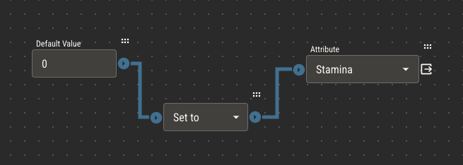
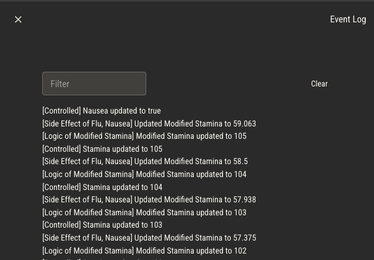

# Side Effects

Picture a game mechanic where characters can catch an illness like the flu. Characters that have the flu have their stamina reduced by 25%.

:::note Attributes
Stamina (controlled number)

Flu (controlled boolean)

Modified Stamina (derived number)
:::

:::tip
Note the use of two attributes to represent stamina. This pattern lets players continue to control their stamina, while reading
their modified stamina as another field on their sheet.
:::

Knowing what we know about attribute logic so far, we can set up this automation within the logic of Modified Stamina.

:::note Modified Stamina Logic
Set Modified Stamina to Stamina

If Flu is true

= Multiply by 0.75 (our 25% reduction)
:::

This works really well and is the recommended approach for this example. However, what if we introduce another illness, Nausea, which also affects Stamina?

If Nausea reduces a player's stamina by another 25%, we'll have to account for that in the logic of Modified Stamina.

:::note Modified Stamina Logic
Set Modified Stamina to Stamina

If Flu is true AND Nausea is false OR Nausea is true AND Flu is false

= Multiply by 0.75

Else If Flu is true AND Nausea is true

= Multiply by 0.75

= Multiply by 0.75

= why twice? 75% of 75% of something isn't the same as 50% of it
:::

I don't know about you, but **I'm** starting to get nauseated.

This still works, but you can see how just introducing one more illness means we have to have several more conditions in our logic. As we introduce more illness attributes,
this will quickly become too much to handle.

## Affecting Other Attributes from Logic

We can build our game mechanics in a more _horizontal_ direction by keeping the mechanic of each illness within that attribute's logic. We can do this with a Side Effect.

A Side Effect has the power to alter a _different_ attribute's value and is triggered every time its attribute changes.

As a Side Effect of Flu, we can add this logic.

:::note Side Effect of Flu
Affecting Modified Stamina

If Flu is true

= Multiply by 0.75
:::

We can add the exact same logic as a Side Effect of Nausea.

The logic of Modified Stamina becomes simple.

:::note Modified Stamina Logic
Set to Stamina
:::

Because we added a Side Effect to Flu, it will be triggered every time Flu changes. When we set Flu to be true, it will multiply Modified Stamina by 0.75.

But since the same Side Effect is added to Nausea, changing it will take the current value of Modified Stamina (now 75% of the original), and multiply it again by 0.75.

## Modifiers

You can think of Side Effects as producing modifiers, or temporary alterations to an attribute. This makes them good candidates for mechanics like buffs and temporary statuses.

## Take Caution not to Overuse Side Effects

You may be tempted by the simplicity of Side Effects to always use them. There are some downsides to doing so.

First, it makes it difficult to trace the origin of complex mechanics. Since any attribute could alter any other as a Side Effect, it can be difficult to understand why
an attribute is changing if you have too many. It's much easier to see all of the relevant logic of an attribute directly in its logic editor. You can use the event log to trace the origin of attribute changes when needed.

Second, introducing bad logic is much easier to do with Side Effects. For example, if an attribute changes the value of an attribute it uses to derive its _own_ value, it will never have a correct value.
This is called a circular dependency. Avoid Side Effects is an easy way to avoid this in most cases.

Finally, you may be tempted to substitue a Side Effect for an Action. For example, you could create a controlled boolean attribute called Long Rest, which has a Side Effect of restoring a character's Hit Points when changed.
At a glance, this works, but it isn't the intended use. Mechanics that happen instantly (like the click of a button) should be Actions, while alterations that affect attributes while some condition is true (like a temporary status)
should be Side Effects.
