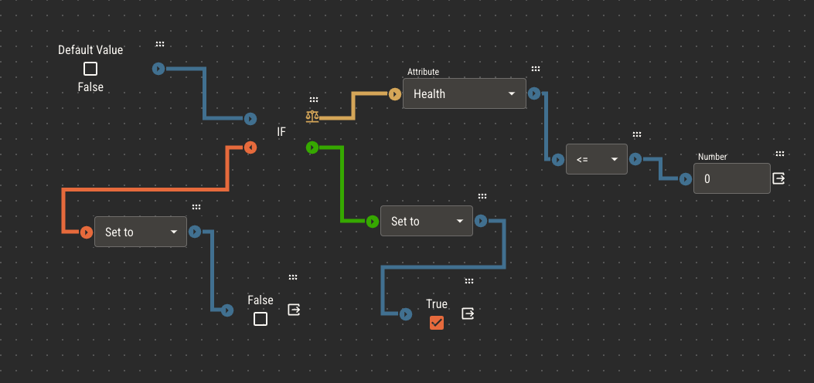
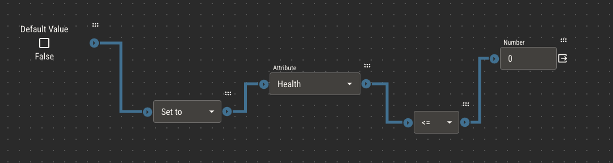

# Simplifying Logic

Attribute logic can quickly become complex. To make sure your sheet templates automate correctly, it's best to keep each attribute's logic as simple as possible.
Here are a few tips to keep in mind.

## Only automate what you need

It may be tempting to add logic to every attribute, but too much automation can make your players feel like they're not in control of their character sheets.

Remember that your players know they're playing a tabletop game, not a video game. They expect to need to read your rules and do some calculations themselves. In fact, that's
part of the fun of playing a tabletop game!

The best candidates for automation are attributes that are always derived from one or a few other attributes.

## Make extra attributes when needed

If you find yourself writing complex logic for an attribute, consider that there may be too many variables in your logic and it should be separated into multiple attributes.

For example, if your game has an athletics attribute which ultimately determines how much a character can carry, it might look something like this.

> Carry Capacity = Athletics \* Level / 2 + Strength

First, you find a modifier by multiplying athletics by a character's level, then divide that by 2. To get carry capacity, you add that modifier to the character's strength.

This works, but there are a couple of limitations.

1. If you ever need to derive that modifier in another attribute, you'll have to recreate this logic for _that_ attribute
2. While this example is relatively short, it can quickly become difficult to read and understand as you expand your ruleset

Alternatively, separate the modifier into its own attribute.

> Atheltics Modifier = Athletics \* Level / 2

> Carry Capacity = Athletics Modifier + Strength

:::tip
Just because an attribute is in your ruleset doesn't mean you _have_ to include it in your sheets or rulebook.

Some attributes can exist simply to hold variables and make logic easier to work with.
:::

## Favor operations over conditions

Conditions are nodes that separate your logic into multiple branches. Consider the following example, which flips a character's death attribute
to true if their health is less than or equal to 0, or false if it's greater than 0.

This works perfectly fine, but there's a simpler approach. Remember that [comparison chains](./logic#comparisons) always resolve to true or false. Instead of
using a condition, you can assign the result of the comparison directly to the death attribute.

