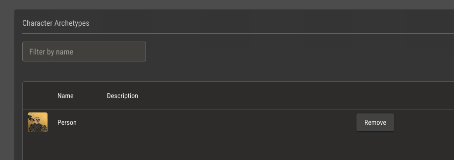

# Characters

You can create a character from any ruleset on your shelf that has at least one archetype which is allowed character assignment.

When you create a character, you'll choose its initial archetype and an optional sheet template. Both of these can be changed after creation.

## Character Archetypes

Your character can have as many archetypes as needed. Adding an archetype will add all attribute variations assigned to that archetype to your character.

## Character Sheets

By default, Quest Bound will create a simple character sheet for each of your characters. This sheet will have a field for every attribute in the character's ruleset.

For any attributes with logic, these fields will be [automated](./attributes/automating-sheets.md).

A sheet will also be created from the selected template. At any time, you can edit this sheet using the [sheet editor](./sheet-templates.md). These edits will be specific to that
character's sheet.

You can replace a character's sheet by selecting a new template at any time. Any edits you made to the previous sheet will be lost. The character's attributes will remain unchanged.
