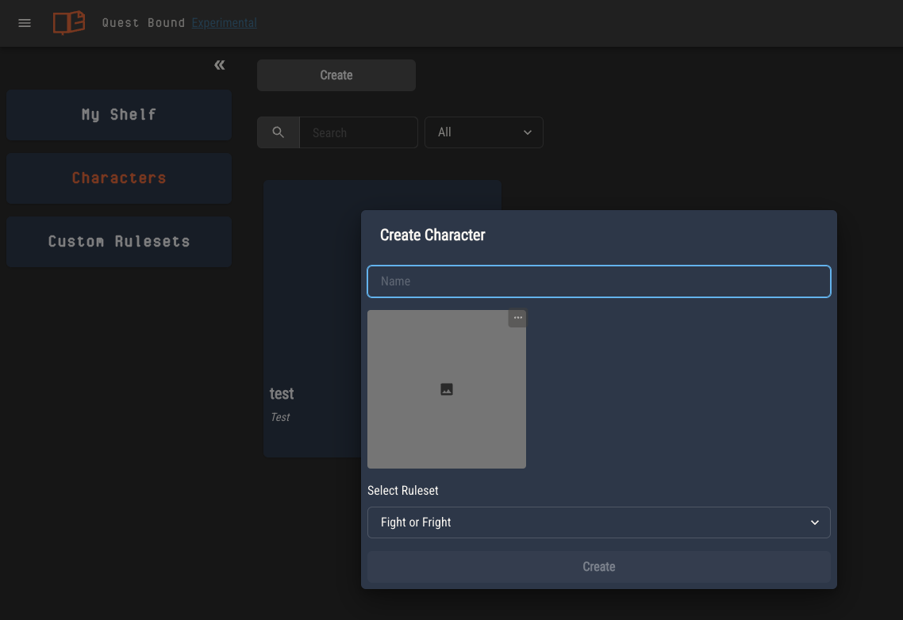

# Characters

Characters are the primary way players interact with their rulesets. Characters are created directly from rulesets; either the ones on your shelf or your custom rulesets.

Create a character by selecting the ruleset, then clicking "Create Character".

Alternatively, click "Create" from the characters page.

## Character Sheets

By default, Quest Bound will create a simple character sheet for each of your characters. This sheet will have a field for every attribute in the character's ruleset.

For any attributes with logic, these fields will be [automated](./attributes/controlling-attributes.md).

A fully editable sheet is also created. If you select a template from the ruleset during character creation, this sheet will be a copy of it. Otherwise, it will be blank.

At any time, you can edit this sheet using the [sheet editor](./sheet-templates.md). These edits will be specific to that
character's sheet.

You can replace a character's sheet by selecting a new template at any time. Any edits you made to the previous sheet will be lost. The character's attributes will remain unchanged.

## Viewing Ruleset Content

Ruleset content is viewed from the slide out panel by selecting the content type from the drop down.

This gives you a read only view of the rulebook, documents and charts of a ruleset. Documents may be downloaded from this view.

## Character Journals

Every character is created with a journal. A journal is a way for players to use the Page Editor to keep track of their character's adventure.

Journal pages may be arranged just like a rulebook by dragging the page titles into a hierarchy. Pages may link to each other and include all of the same components used when creating the rulebook.

## Streaming a Character Sheet

You can broadcast a single tab of any character sheet to a separate page. This page can be viewed by anyone without logging into Quest Bound.

The stream link for a given character is `https://questbound.com/stream/<character ID>`. You can find this in the character's sheet settings page.

To disable streaming for a character, select "None" in the stream tab options drop down.

Streamed pages update in near real time as the character is updated, either from the character sheet or simple sheet. Updates to the layout of the stream tab
will appear within a few seconds.

### Streaming in OBS

You can render a character's stream tab in OBS by creating a new browser source and placing the stream link in the URL field.

Using the default settings will make the background of the stream page transparent, or you can enter these settings in the Custom CSS field.

`body { background-color: rgba(0, 0, 0, 0); margin: 0px auto; overflow: hidden; }`

