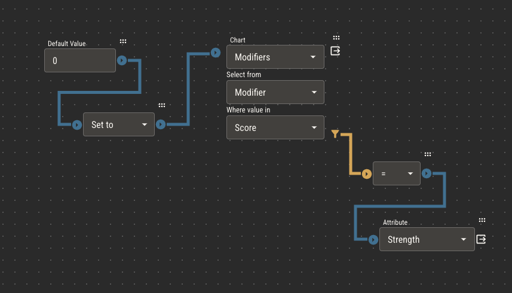

# Charts

Charts are two dimensional data sets made of columns and rows, like a spreadsheet. Charts provide a method of storing and referencing the large amounts of data that generally make up TTRPGs.

:::caution
Charts have limited editing capabilities in Quest Bound. Use a program like Excel or Google Sheets to create your data, then upload it to a chart as a .csv file.

You can edit individual cell values in Quest Bound, or you can upload a new file to an existing chart at any time to update its data.
:::

## Referencing Charts

There are two places you’ll likely need to reference chart data: [rulebook pages](./rulebook.md) and in [attribute logic](./logic/logic.md).

Rulebook pages can display charts as a table which can easily be formatted.

Chart components will always read directly from the chart, meaning the pages will update automatically as you update the charts in your ruleset. Read more about how this works on the [rulebook page](./rulebook.md).

### Chart Logic Nodes

In attribute logic, a chart node will allow attributes to scan charts and pull data from a specific cell, applying its value to its logic calculation.

1. In the first field, select a chart to scan
2. In the second field, provide the name of the column from which to pull the _value_
3. In the third field, provide the name of the column from which to filter the rows
4. Connect a comparison chain to filter the chart's rows

:::info
The **first** row that passes the comparison chain will be used to provide the value for the chart node.
:::

In the example below, the chart node scans the selected chart. For every row in the chart, it checks if the value in the Score column is equal to this character's Strength.
If the score matches, the chart node provides the value of that row's Modifier column.

Assuming the Strength of this character is 3, the value now provided to the output of the chart node is -4.
