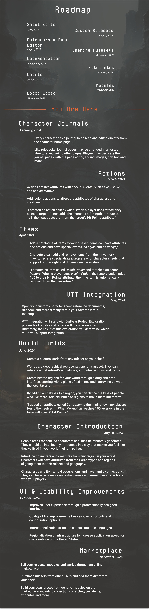

# What's Next

Quest Bound is still in development. Here are some of the features planned for the future.

:::info Want to help shape Quest Bound?

Join our [Discord](https://discord.gg/7QGV4muT39) and let us know what you'd like to see next!
:::

## Support Quest Bound on Kickstarter

You can support the future of Quest Bound's development by backing us in the upcoming [Kickstarter campaign](https://www.kickstarter.com/projects/quest-bound/quest-bound-tabletop-game-engine).

Backers who pledge at least $50 will have access to Quest Bound for life, including Early Access to the latest features.

## Virtual Tabletop Integration

Read a rulebook from your shelf and use your character sheet directly in your favorite VTT.

Pull archetypes out to introduce characters and creatures during gameplay.

## Marketplace

Sell your rulesets to other users on a marketplace.

## Character Journal

Add pages to a journal that's unique to every character.

Arrange and link between pages to create a wiki for your character.

## Actions

Add actions to archetypes to be inherited by characters and creatures.

Actions are special attributes that can target _other_ entities and affect their attributes.

Attacks, spells, and other abilities could all be actions.

## Items

Add items to your ruleset and assign attributes and actions to them.

Items can be added to the inventory of characters and creatures.

## Worlds

Create a world from a ruleset on your shelf.

Worlds have regions which can have attributes and locations.

Regions can be assigned archetypes, which will dictate what characters and creatures appear there. Regional variations
can be applied to each archetype.

Introduce characters and creatures within a location. Those entities will be introduced from the archetypes assigned to that location's region.

Add scaled, grid-based maps to locations to track character location.

Open locations from your favorite VTT.
