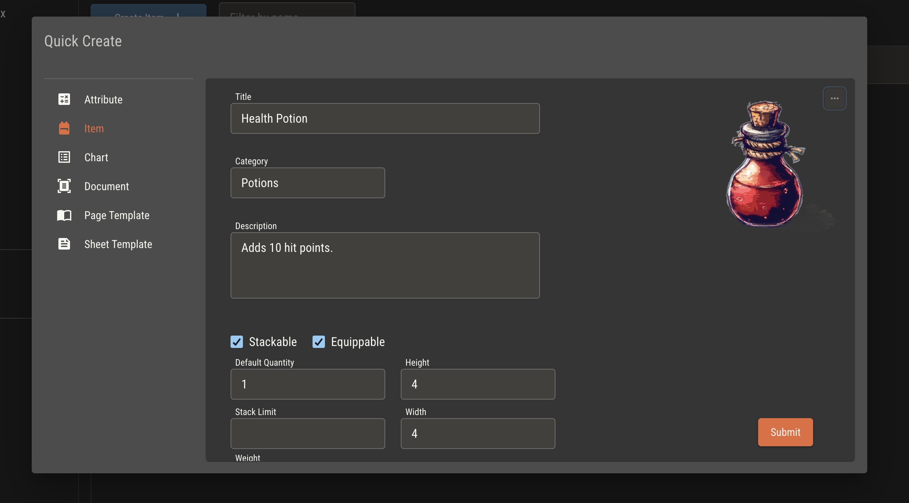
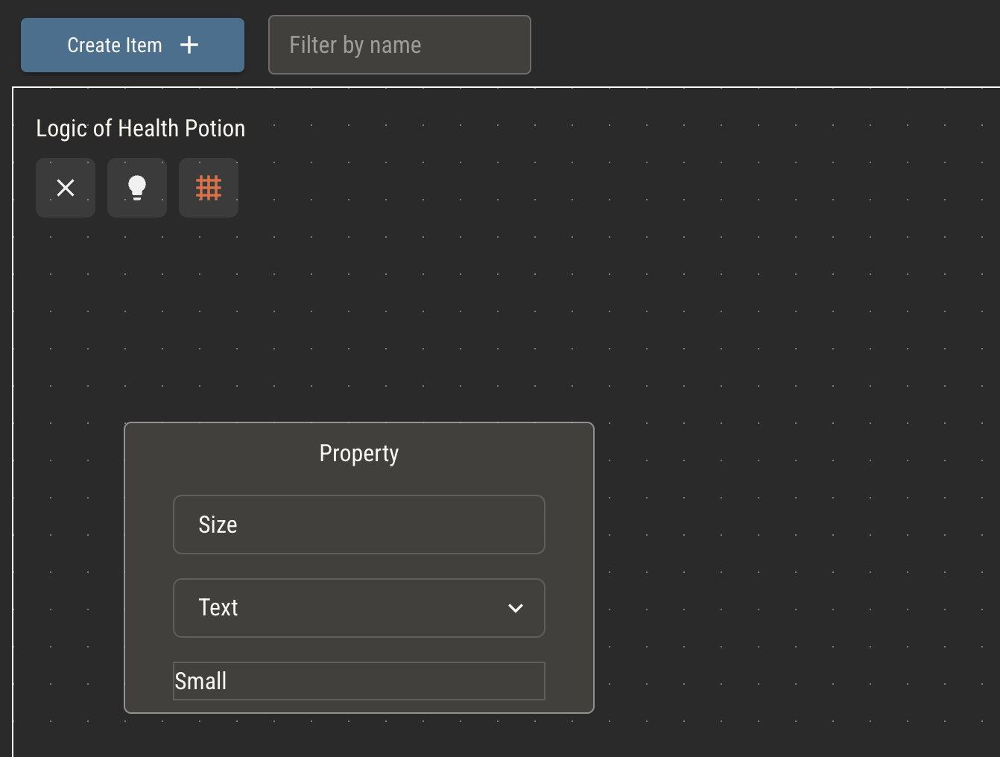
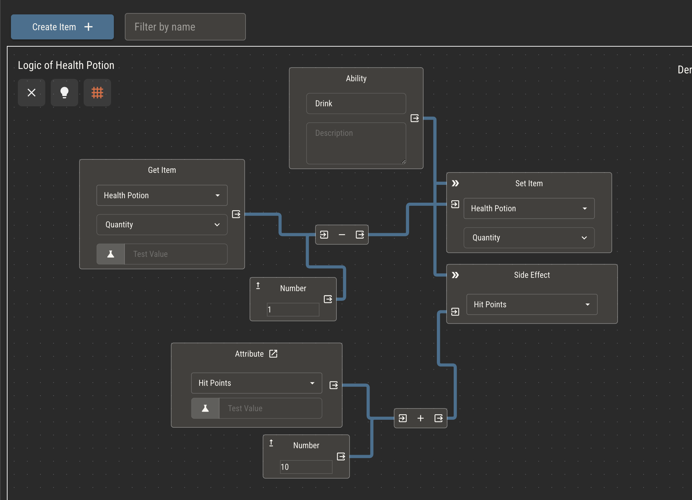
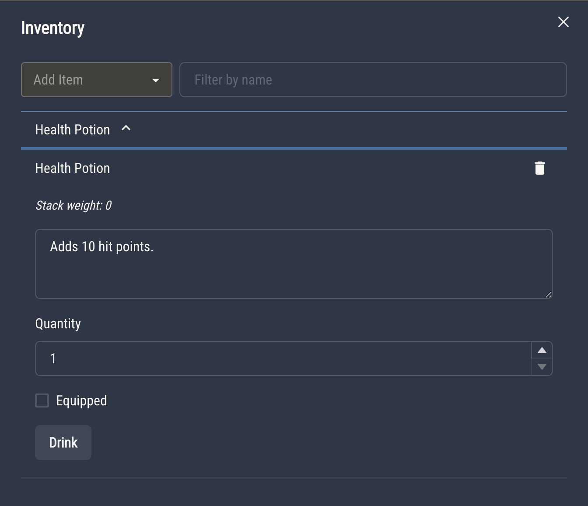
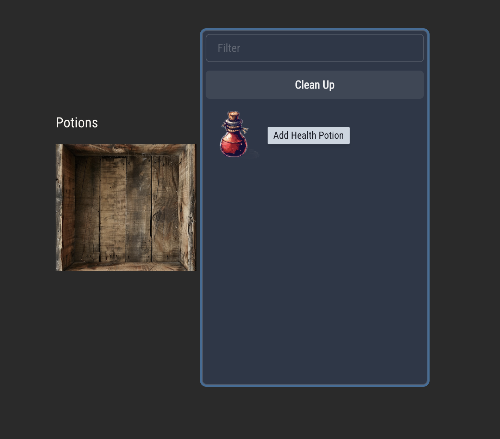
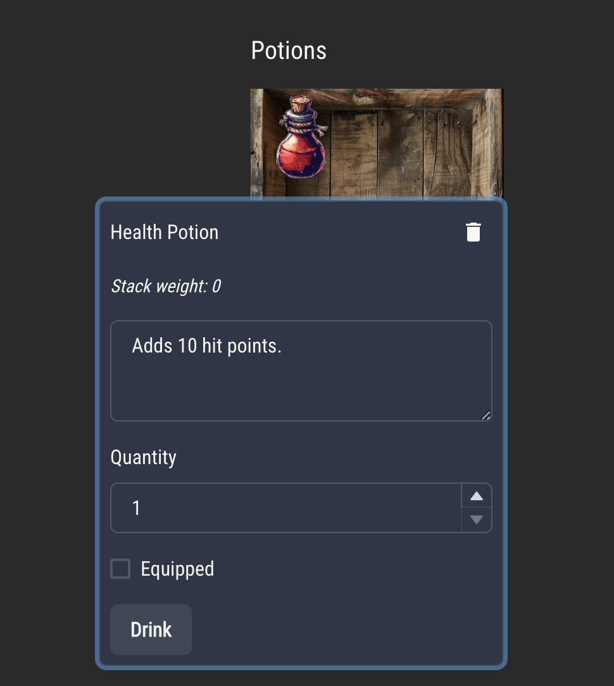

# Items

Items are a feature set of ruleset entities that are built on top of attributes. Like attributes, you create and manage individual items, which get added to a set of available items in your ruleset.

Items may be added to a character's inventory and used by players from the character view.

## Properties

Items have properties which describe them. By default, every item comes with two properties--quantity and equipped. These can be controlled by players from a character's inventory.

Items also have height, width and weight. Height and width determine the number of grid squares an item takes in a character sheet. These are used to prevent items from being added to an inventory node in which they don't fit.

An item's weight is multiplied by its stack size, then displayed in an inventory. You can access a character's total inventory weight from logic using the `Get Inventory` logic node.

:::tip
If you don't want an item to have the default properties, you can uncheck them during item creation.
:::

### Custom Properties

You can add custom properties to an item by adding a `Property` node to its logic. Like attributes, item properties must have a type. Custom properties are controlled in a character's inventory just like the default properties.

Item properties may be accessed from logic, (including attribute logic), using the `Get Item` logic node.

:::tip
When using `Get Item` within an item and selecting the same item type, the node will refer to _this_ item.

When using it in logic nodes or for other item types, it will refer to the _first_ item of that type in a character's inventory.
:::

## Abilities

Item abilities work like action attributes. They must be triggered by the player from the character's inventory. Abilities can access item properties and attributes and trigger side effects.

Add an ability to an item by adding an `Ability` logic node. Abilities can access other items and attributes from logic.

# Inventory

## Simple Inventory

A simple inventory is always accessible from character sheets via an icon in the top right. The simple inventory will display a list of a character's items in collapsible containers, each holding the item's properties and abilities.

## Inventory Nodes

You can also create your own inventories within sheet templates by using the `Inventory` node. In view mode, clicking an `Inventory` node will bring up a menu of items the player may add to it.

Clicking an item in this view will open a window with that item's properties and abilities.

## Slot Keys

You may restrict which items may be added to which inventories using slot keys. Every item may hold an optional comma-separate list of keys. If any keys have been added to an inventory, it will be restrict to the matching set.
