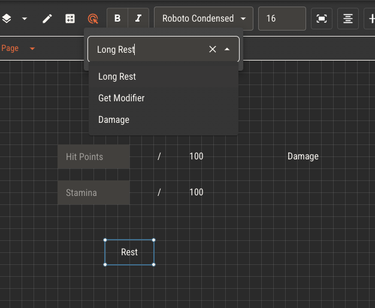
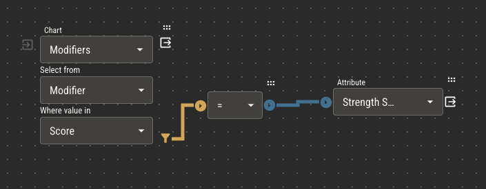
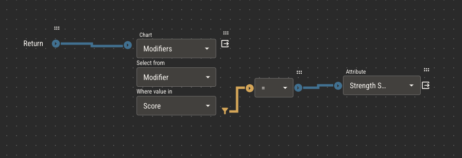
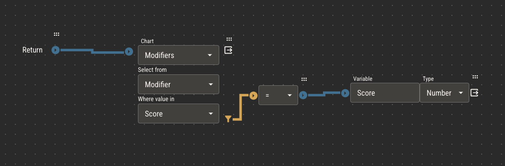
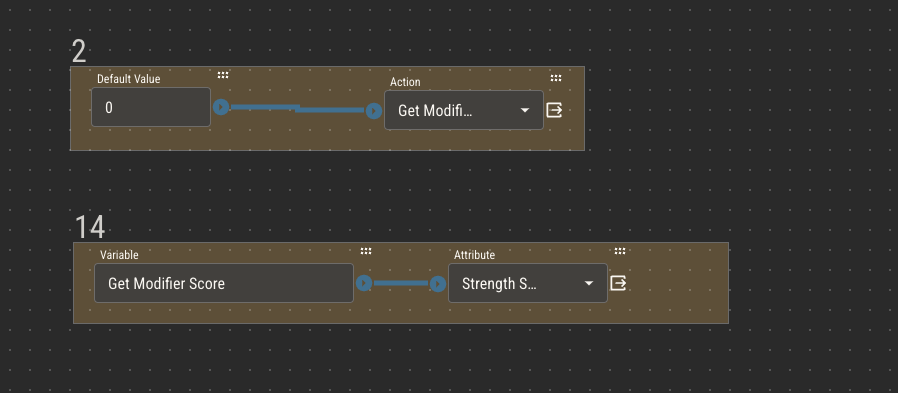

# Actions

Actions are special types of attributes that differ from the primitive types in two key ways:

1. Actions do not have values
2. Actions may be triggered manually from character sheets

While derived attributes are constantly recalculating their own values, you can think of actions as responding to events.

_When a character takes damage_, their hit points are reduced. Until the damage event occurs, the logic within the action will not be evaluated.

## Determinism

In almost all cases of primitive attributes, you want the logic evaluation to result in the _same value_, assuming nothing else has changed. For example,
if a character's strength score is 14, their strength modifier is 2. As long as their strength score remains 14, the modifier value should be 2, no matter how
many times it reevaluates.

Logic that behaves this way is considered to be deterministic. With few exceptions, derived attributes are deterministic.

Actions, however, do not need to result in the same value on every evaluation. When one character attacks another, the player might roll a die to inject some
randomization into the result. Since the value of the dice roll could be different every time, the result of the action is _not_ deterministic.

You can use dice nodes to inject randomization into logic, but be weary of doing so in attributes that should behave deterministically.

## Two Behaviors of Actions

### Side Effects in Actions

Just like other attribute types, actions can have side effects that alter the value of other attributes. While in primitive attributes, side effects are triggered every time the value of the host attribute changes, they must be triggered manually in actions.

Within character sheets, text, image and shape components can have actions assigned to them. When an action is assigned to one of these components, it becomes clickable. Clicking a component
with an assigned action will trigger that action.

:::caution
Side effects in actions permanently alter their affected attributes!
:::

The behavior of side effects in actions is slightly different than in primitive attributes. You can think of side effects in primitives to add modifiers to the attributes they affect. For example,
a boolean attribute called 'Poisoned' may temporarily decrease the 'Hit Points' attribute by 10% when true. When Poisoned is false, it will restore Hit Points back to what it was before the change.

Side effects in actions, however, _permanently_ alter the affected attribute. If Poisoned were an action, it would permanently reduce Hit Points by 10% every time it's triggered.

:::tip
An easy way to decide if something should be a primitive attribute or an action is to use it in a sentence.

If the word you use is a _verb_, it's likely an action. If it's an _adjective_, it's probably primitive.

Poisoned, which temporarily decreases hit points, is a primitive attribute.

Poison, which permanently decreases hit points, is an action.
:::

### Return Values

Other than altering attributes manually, actions provide a convenient way of reusing logic across various attributes in your ruleset.

Actions do not have values themselves, but they can _return_ values within the logic of other attributes. The value of the statement attached to the return node will be available
in other attribute logic when the action is selected in the attribute node.

This works in the same way as primitive attributes, which have their values available by attaching statements to the default value node. A key difference is that actions can accept dynamic
parameters to be used in their evaluation, meaning the result of an action used in one attribute can be different than one used in another attribute.

Suppose you have a chart with ability scores in one column and modifiers in another. You need to reference this chart within each of the six core modifiers in order to derive their values given their corresponding score.

The logic to derive the strength modifier would look like this.

You could copy this logic and paste it in the other five modifier attributes, changing the attribute in each. Another option is to make an action which _returns_ the value of the modifier given a _parameter_, score, used to find the correct value.

To do this, make an action called 'Get Modifier' and attach the logic above to the return node.

Next, replace the Strength Score attribute with a variable. Name the variable 'Score' and set its type to number.

Now, within another attribute, Strength Modifier for example, you can reference Get Modifier with an attribute node. To provide the Score parameter, use a variable node and give it the value "Get Modifier Score".

:::tip
To use a variable node as an action parameter, give it a value of `{{Action Name}} {{Parameter Name}}`.

Note that the name of the parameter is declared by variable nodes within the logic of the action.
:::
