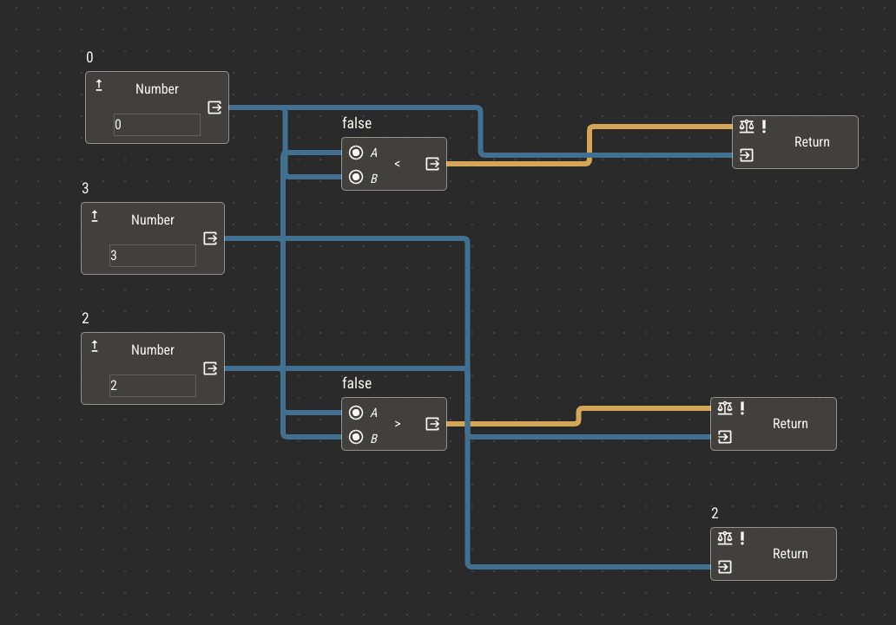
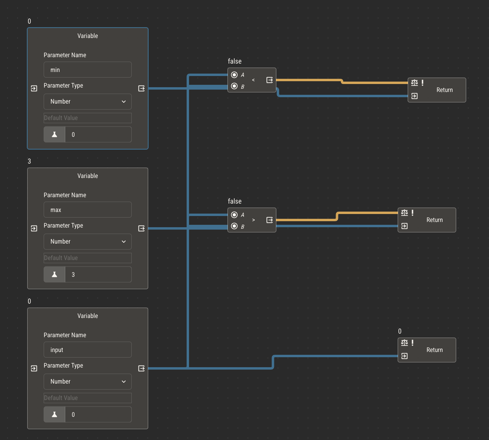
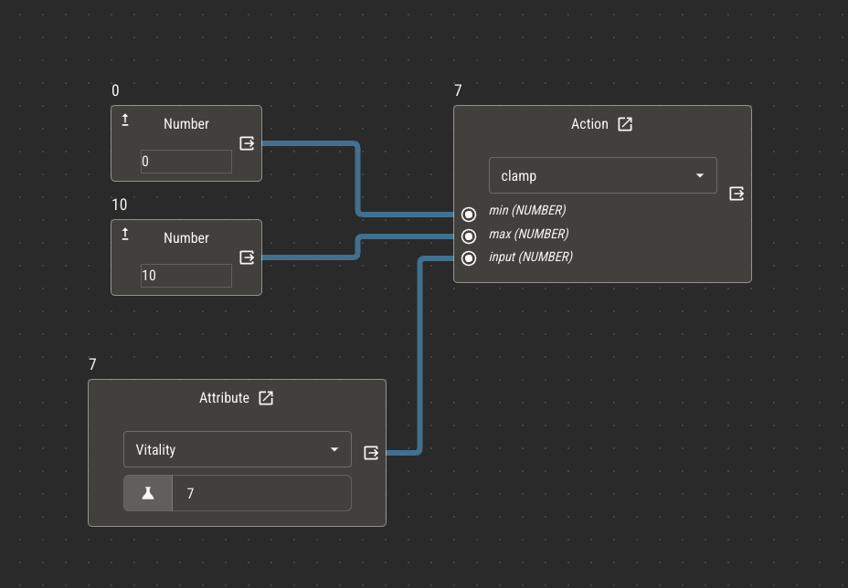

# Actions

Actions are special types of attributes that differ from the primitive types in two key ways:

1. Actions do not have values
2. Actions may be triggered manually from character sheets

While derived attributes are constantly recalculating their own values, you can think of actions as responding to events.

_When a character takes damage_, their hit points are reduced. Until the damage event occurs, the logic within the action will not be evaluated.

## Determinism

In almost all cases of primitive attributes, you want the logic evaluation to result in the _same value_, assuming nothing else has changed. For example,
if a character's strength score is 14, their strength modifier is 2. As long as their strength score remains 14, the modifier value should be 2, no matter how
many times it reevaluates.

Logic that behaves this way is considered to be deterministic. With few exceptions, derived attributes are deterministic.

Actions, however, do not need to result in the same value on every evaluation. When one character attacks another, the player might roll a die to inject some
randomization into the result. Since the value of the dice roll could be different every time, the result of the action is _not_ deterministic.

You can use dice nodes to inject randomization into logic, but be weary of doing so in attributes that should behave deterministically.

## Two Behaviors of Actions

### Side Effects in Actions

Just like other attribute types, actions can have side effects that alter the value of other attributes. While in primitive attributes, side effects are triggered every time the value of the host attribute changes, side effects in actions are only
executed when the action is manually triggered.

Within character sheets, text, image and shape components can have actions assigned to them. When an action is assigned to one of these components, it becomes clickable. Clicking a component
with an assigned action will trigger that action.

:::tip
An easy way to decide if something should be a primitive attribute or an action is to use it in a sentence.

If the word you use is a _verb_, it's likely an action. If it's an _adjective_, it's probably primitive.

Poisoned, a status which decreases hit points as soon as it occurs, is a primitive attribute.

Poison, an act done to a character which permanently decreases hit points, is an action.
:::

### Return Values

Other than altering attributes manually, actions provide a convenient way of reusing logic across various attributes in your ruleset.

Actions do not have values themselves, but they can _return_ values within the logic of other attributes. The value of the statement attached to the return node will be available
in other attribute logic which use the action node.

This works in the same way as primitive attributes, which have their values available by attaching statements to the default value node. A key difference is that actions can accept dynamic
parameters to be used in their evaluation, meaning the result of an action used in one attribute can be different than one used in another attribute.

Suppose you often find yourself creating logic to clamp a number between some minimum and maximum. It might look something like this.

By making this a separate action and replacing the primitives with parameters, you can reuse this logic in other attributes.

