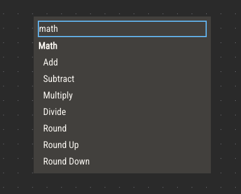
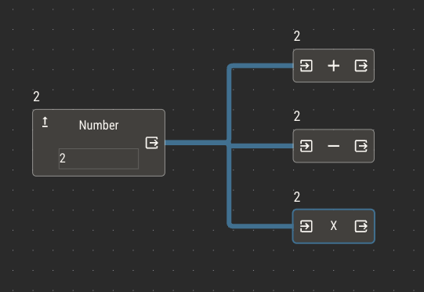
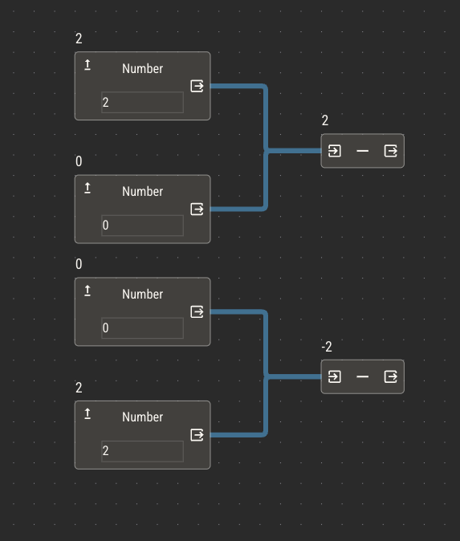
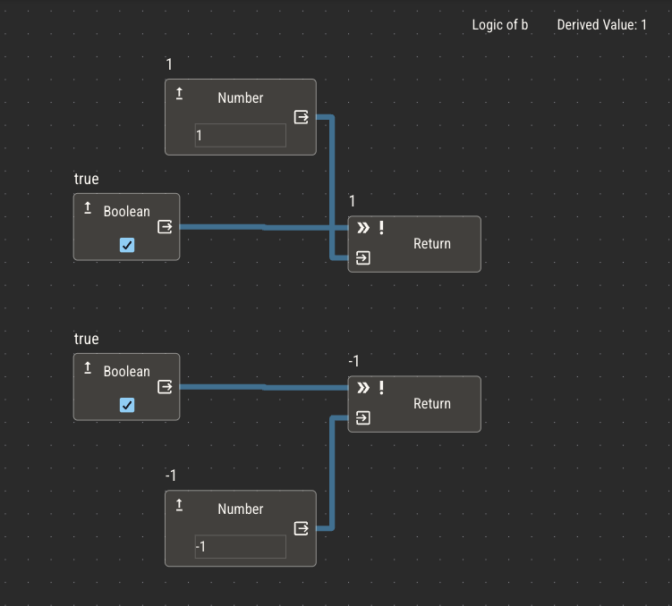
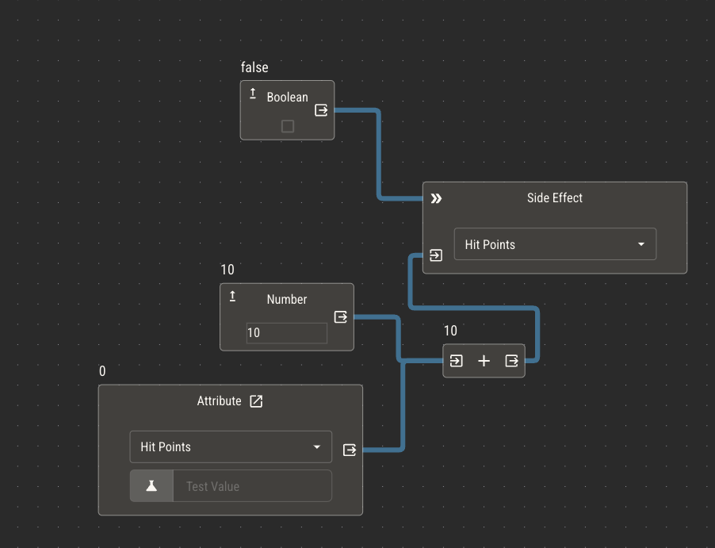

# Building Logic

## Editor Controls

The logic editor is an infinitely panning canvas where you can place and connect nodes.

Move the canvas by clicking and dragging anywhere or by scrolling. To zoom, hold CMD on MacOS or CTRL on Windows and zoom.

Select nodes by clicking on them. A blue border will appear on selected nodes. You can also hold Shift and drag over multiple nodes to select them all, or click multiple nodes while holding Shift.

There are three sets of controls on the logic editor.

In the top left, you can:

- Enable the display of node values
- Toggle snap-to-grid mode
- Duplicate selected nodes

In the top right, you can:

- Check the attribute you're editing
- See the final derived result of the logic
- Reset the logic
- Navigate to the attribute chart

Finally, in the bottom right, you can:

- Zoom in and out
- Center the editor to your nodes
- Lock all nodes for easier viewing

Place new nodes from the context menu. You can open the context menu by right clicking on the editor, or pressing Shift + Enter.

You can search the context menu by node name or category. Pressing Enter will place the node currently at the top of the list. From here, you may
also select attributes and charts directly.

## Input / Output

All nodes have inputs and outputs (IO) that allow you to connect them to other nodes. Generally speaking, inputs to nodes are on their left side, while outputs are on their right.

There are several types of IO.

- Input
  - Passes a value or multiple values to a node. These values are used in the node's operation.
  - While multiple inputs are sometimes used, such as for Add nodes, they aren't always. If a node's operation only requires one input, it will take the first one connected.
- Output
  - Passes the result of a node's operation.
- True Branch Output
  - When its condition is true, passes an IF node's input. Can also be connected directly to execute IO.
- False Branch Output
  - When its condition is false, passes an IF node's input. Can also be connected directly to execute IO.
- Condition
  - Controls the operation of a node based on a boolean input.
  - For IF nodes, this IO controls which branch is active.
  - For chart nodes, this IO controls which row of the chart is selected.
- Execute
  - Can prevent the operation of a node entirely. If nothing is connected to an execute IO, the node will operate normally. If a node is connected, it will only operate if the connected node's value is true.
- Parameter
  - Provides a specific value needed for a node's operation. For example, supplying the A and B values to a Greater Than operation.
  - Action nodes use parameter IO to supply its parameters.

## Primitive Values

Any node that holds a primitive value will simply supply that value through its output. Primitive nodes do not take inputs, because they have no internal operation in which to use them.

Nodes that hold primitive values are:

- Number
- Text
- Boolean
- Attribute
- Dice
- Chart
- Default Value

Actions and variables also provide primitive values, but they do have internal operations that require inputs. Actions will need parameters, depending on the action, and variables need to be assigned values through their input.

You may connect the output of these nodes to as many other nodes as necessary. They will provide their value to all of them.

## Ordering Nodes

Sometimes, it's necessary to dictate an order in which a node receives input. For example, you may want to control the order of operations on a subtract node.

Nodes will sort their inputs by the order of their vertical placement in the editor.

This is especially important if you have multiple return nodes which are executing simultaneously. The first return node will be used to derive the result of the logic.

## Execute Inputs

You may only want certain nodes to be considered if some condition is met. For example, you may want to trigger a side effect if some boolean attribute is true.

Execute inputs allow you to dynamically disable or enable certain nodes. If the value of the connected node is false, the node will not execute. If the value is true or if nothing is connected, it will.

