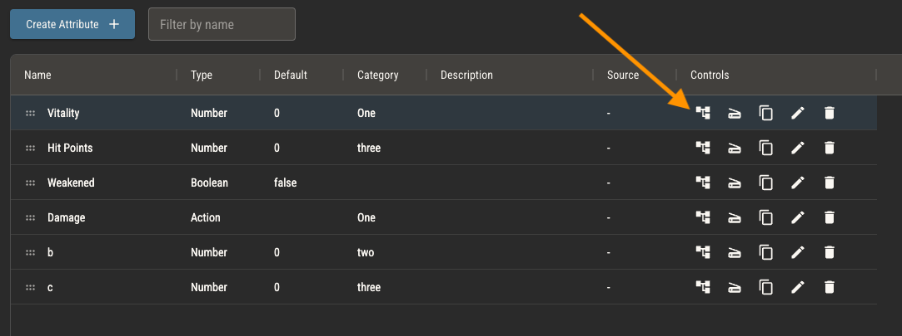
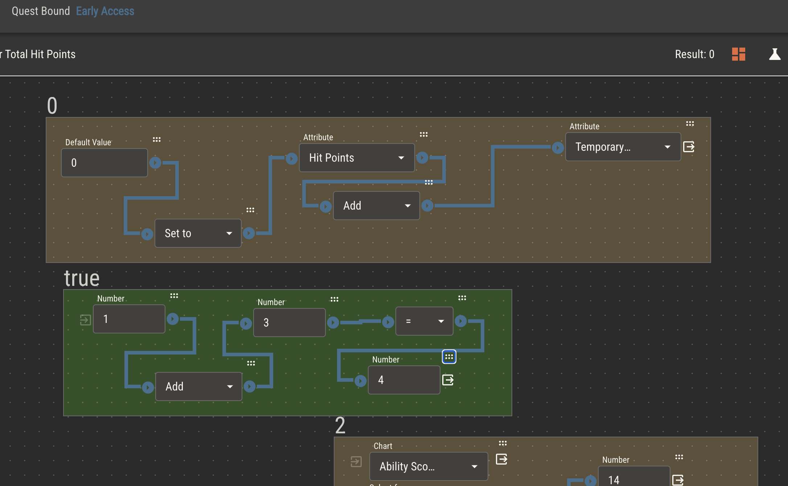
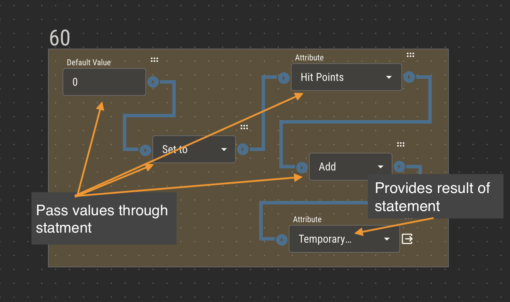
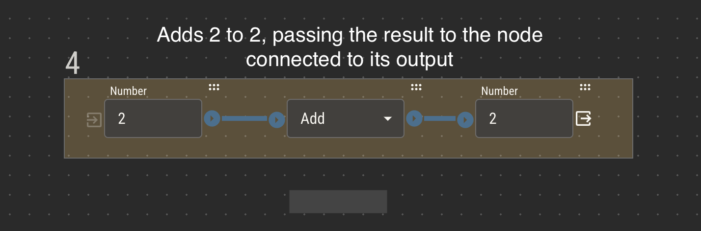
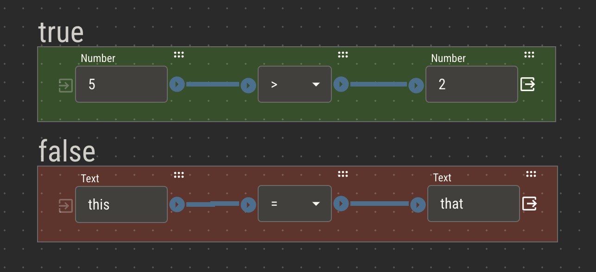
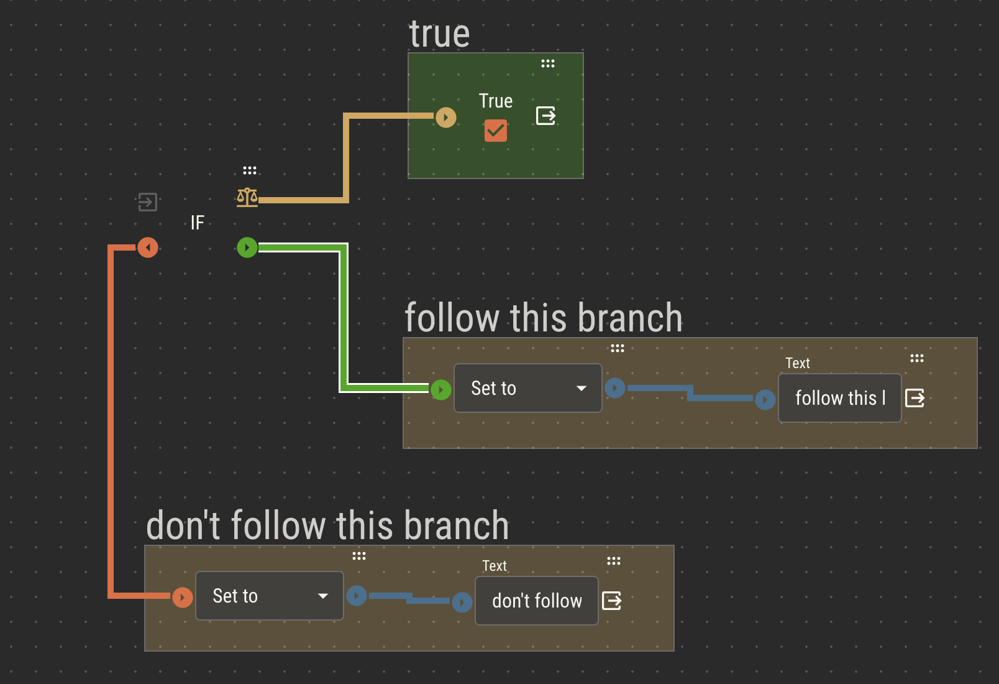
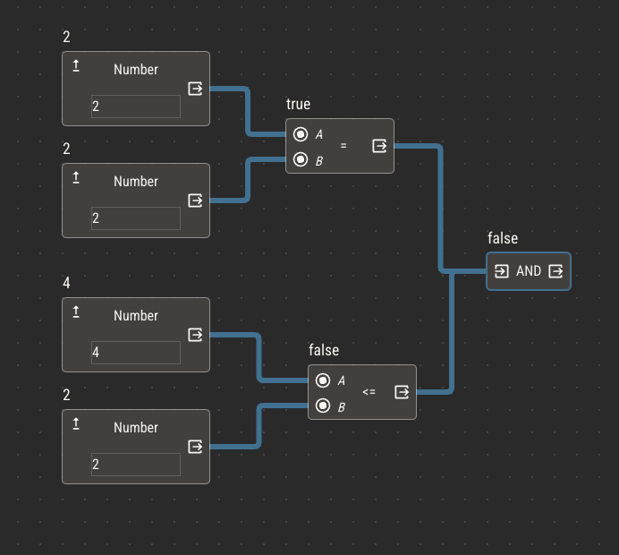
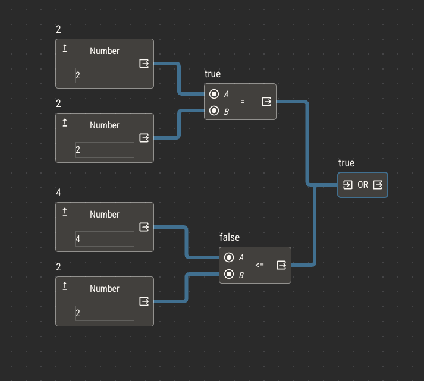
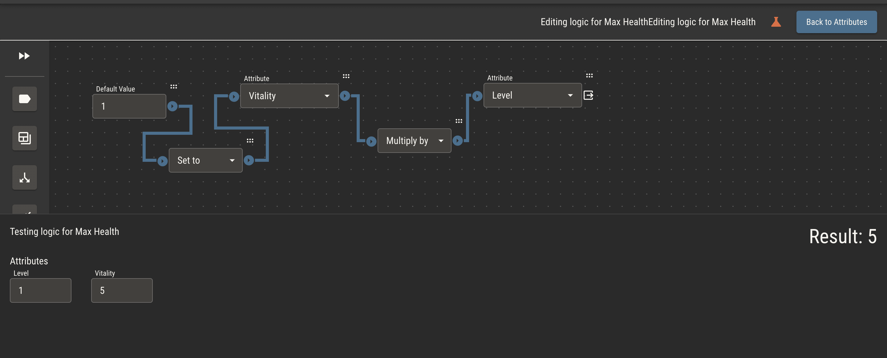
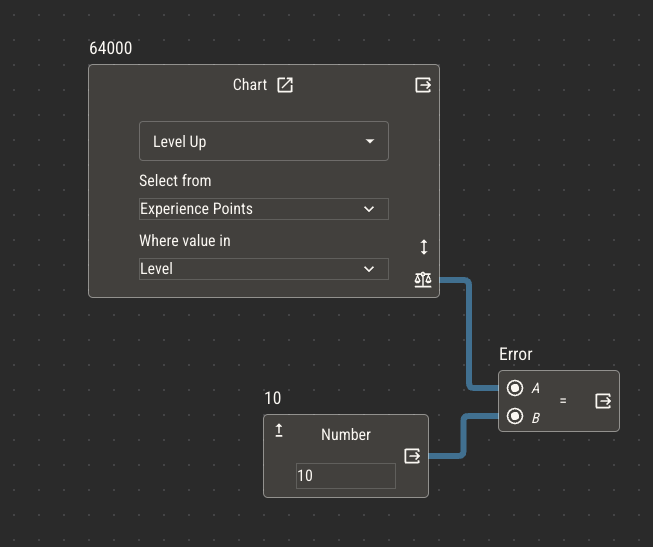

# Automating Your Ruleset with Logic

Mechanics of your game can be captured within Quest Bound as logic, then used to automate character sheets. Logic is added to attributes with the Logic Editor. To edit an attribute's logic, select the attribute and click the logic button to open this editor.

## Controlled Values

As described in [Intro to Attributes](../attributes/attributes.md), attributes are variables assigned to entities like characters. Every character has its own copy of attributes which can be controlled from its sheet.

When playing a TTRPG with pen and paper, players are expected to manually update the attributes on their character sheets, erasing and rewriting values as they change.

Sheets in Quest Bound give the same control to players. For every attribute in your ruleset, you can [add a field](../attributes/controlling-attributes) to a sheet which allows players to manually update the value of that attribute.

Controlled attributes do not need logic.

## Derived Values

Suppose you have a number attribute called Max Health. In your game, Max Health is always the value of another number attribute, Vitality, multiplied by a third attribute, Level.

> Max Health = Vitality x Level

In this example, Level and Vitality are controlled by the player based on the rules of your game. Max Health, however, is _derived_ from the values of Level and Vitality. It's not something the player should need to change manually.

You can build this automation directly into the Max Health attribute using its logic.

:::caution
Logic can quickly become complex! For best results, keep it simple and only add logic when automation will greatly benefit your players. Remember, we’re making tabletop games, not video games.
:::

## Visual Programming

The Logic Editor allows for visually programming simple instructions. While there are only a handful of operations available, connecting them together allows for _very_ complex instruction sets.

:::tip
If you’re new to programming concepts, logic can feel overwhelming. Keeping it simple and experimenting will help.

Add a Quest Bound official ruleset to your shelf and check out the logic of several components to get an idea of how it works.
:::

## Statements

A statement is a fragment of logic that evaluates and produces a result independently. Starting with any node, connecting other nodes will add them to its statement. A statement can be as small as a single number or as complex as several operations.

Conditions will branch logic between statements, stitching appropriate statements together to form the complete logic.

To see statements and their results within the logic editor, toggle statement mode using the button in the top right. An overlay will appear over each statement and their results will be displayed on the top left of each.

## Key Points

There are a few key points to understand about the logic editor before wiring up your first attribute.

1. Every logic node takes an input and produces an output

- _the exceptions are Default Value and Side Effect, which do not take an input_

2. Outputs are passed down a statement of connected nodes, with operations applied to the accumulated value
3. The last node in a statement provides the result of that statement

4. Mathematical order of operations is not recognized. Operations move down statments left to right
5. Operations connected to the Default Value node update _this_ attribute. Operations connected to [Side Effects](./side-effects) update _other_ attributes.

## Logic Nodes

### Primitives

Primitives are the most basic piece of data within logic. They are _static_, meaning their values do not change. You may notice that the types of primitives are the same as the types of attributes. This is intentional! When your logic needs one of these values to change based on another value, you can usually achieve that by swapping a primitive with an attribute of the same type.

- Number
  - Provides a single number
- Text
  - Provides a word or string of words
- Boolean
  - Provides a boolean value, true or false

### Operations

Operations are basic math applied to one or two attributes.

The four basic math operations (add, subtract, multiply and divide), perform their operations on the input _and_ output nodes, passing the result through its output.

Set acts like a break in logic, ignoring the running value of the statement provided to its input. Set lets you interrupt operations to its left, meaning the value of its output connection will continue down the statement.

Rounding operations consider their input, passing the rounded value to its output.

- Set
  - Passes its output value, regardless of its input
- Add
  - Passes the sum of its input and output to the next node in the statement
  - When using Add with two text components, it will combine the text
- Subtract
  - Passes the difference of its input and output to the next node in the statement
- Multiply
  - Passes the product of its input and output to the next node in the statement
- Divide
  - Passes the quotient of its input and output to the next node in the statement
- Round
  - Considers its input, modifies it with the below rules, then passes it to the next node in the statement
    - If its a number with a floating point decimal greater than or equal to 0.5, it will round its output up to the nearest whole number.
    - If its a number with a floating point decimal less than 0.5, it will round its output down to the nearest whole number.
- Round Up
  - Rounds its input up to the nearest whole number and passes that to the next node in the statement
- Round Down
  - Rounds its input down to the nearest whole number and passes that to the next node in the statement

### Comparisons

Comparison nodes consider their input and output and pass a boolean value to their output node. The result of a comparison is always either true or false.

Statements that contain a comparison node can be considered a comparison statement. These statements will always resolve to a boolean. Comparison statements can be attached to conditions to branch logic or to chart nodes to filter chart rows.

:::tip
Single boolean nodes and attributes can be considered comparison statements because they resolve to either true or false
:::

- Equal
  - Resolves to true if its input and output are the same value
- Not Equal
  - Resolves to true if its input and output are not the same value
- Greater Than
  - Resolves to true if its input is greater than its output
  - _This only works for number types_
- Less Than
  - Resolves to true if its input is less than its output
  - _This only works for number types_
- Greater Than or Equal
  - Resolves to true if its input is greater than or equal to its output
  - _This only works for number types_
- Less Than or Equal
  - Resolves to true if its input is less than or equal to its output
  - _This only works for number types_

### Conditions

- If
  - Splits logic into two possible branches based on the result of a comparison statement
  - If the comparison resolves to true, it passes its input to the true branch
  - If the comparison resolves to false, it passes its input to the false branch
    
- And
  - Connects multiple comparison statements
  - Resolves to true if **all** connected statements resolve to true
    
- Or
  - Connects multiple comparison statements
  - Resolves to true if **any** connected statment resolves to true
    

### References

- Attribute

  - Reads the default value of another attribute and provides it to its output
  - Inserts a field in the test panel to change the value of the attribute for testing
  - On a sheet, this will take the value of that entity’s (character, creature, etc) attribute, not the default value
    

- Chart
  - Reads a value from a chart and provides it as output
  - Read more about how this works on the [chart page](../charts).
    
