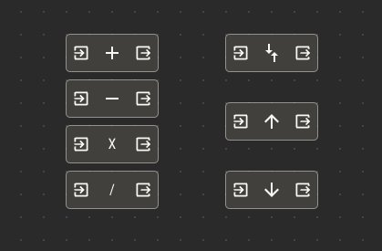
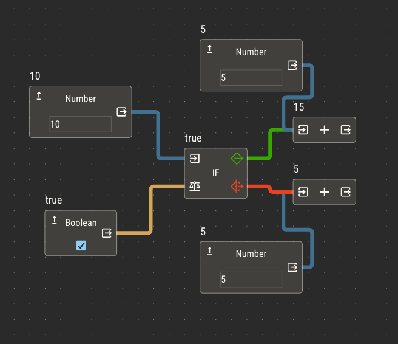
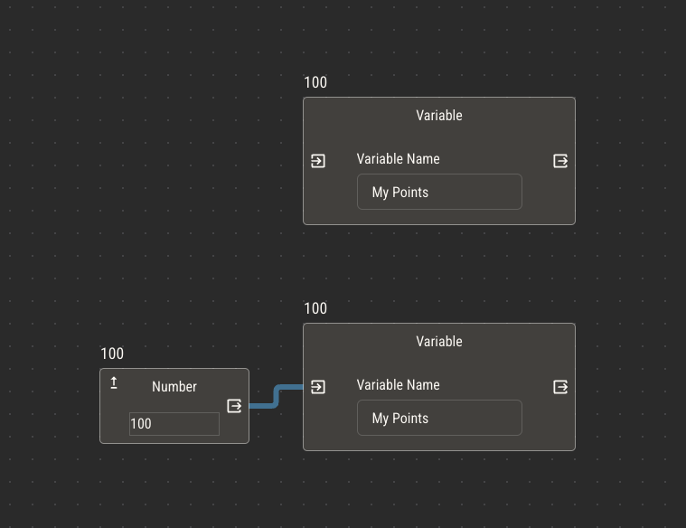
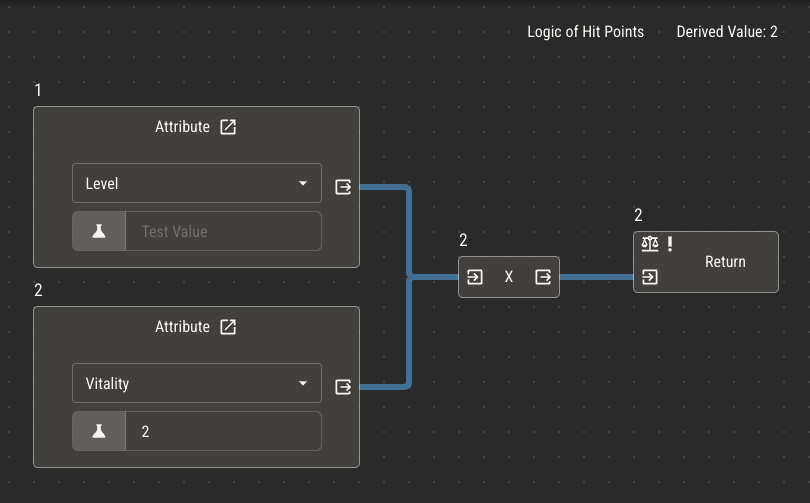

# Logic And Nodes

Mechanics of your game can be captured within Quest Bound as logic, then used to automate character sheets or the creation of rulebook pages. Logic is added to attributes with the Logic Editor. To edit an attribute's logic, select the logic button in the attribute chart.

## Controlled Values

As described in [Intro to Attributes](../attributes/attributes.md), attributes are variables assigned to entities like characters. Every character has its own copy of attributes which can be controlled from its sheet.

When playing a TTRPG with pen and paper, players are expected to manually update the attributes on their character sheets, erasing and rewriting values as they change.

Sheets in Quest Bound give the same control to players. For every attribute in your ruleset, you can [add a field](../attributes/controlling-attributes) to a sheet which allows players to manually update the value of that attribute.

Controlled attributes do not need logic, but may still benefit from it. For example, you can use logic to clamp an attribute's value between a minimum and maximum while still allowing players to control it.

## Derived Values

Suppose you have a number attribute called Max Health. In your game, Max Health is always the value of another number attribute, Vitality, multiplied by a third attribute, Level.

> Max Health = Vitality x Level

In this example, Level and Vitality are controlled by the player based on the rules of your game. Max Health, however, is _derived_ from the values of Level and Vitality. It's not something the player should need to change manually.

You can build this automation directly into the Max Health attribute using its logic.

:::caution
Logic can quickly become complex! For best results, keep it simple and only add logic when automation will greatly benefit your players. Remember that we’re making tabletop games, not video games.
:::

## Visual Programming

The Logic Editor allows for visually programming simple instructions. While there are only a handful of operations available, connecting them together allows for _very_ complex instruction sets.

:::tip
If you’re new to programming concepts, logic can feel overwhelming. Keeping it simple and experimenting will help.

Add a Quest Bound official ruleset to your shelf and check out the logic of several components to get an idea of how it works.
:::

## Key Points

There are a few key points to understand about the logic editor before wiring up your first attribute.

1. Logic is built by adding and connecting _nodes_

2. Every node conducts a specific operation. Most nodes provide the result of that operation as their output

3. Return nodes are used to eject their result outside the current logic, either by assigning it as the attribute's value (primitive attributes), or providing it to other logic (actions)

4. Mathematical order of operations is not recognized

5. When the order of nodes matters, nodes placed vertically higher will be considered first

## Logic Nodes

### Primitives

Primitives are the most basic piece of data within logic. They are _static_, meaning their values do not change. You may notice that the types of primitives are the same as the types of attributes. This is intentional! When your logic needs one of these values to change based on another value, you can usually achieve that by swapping a primitive with an attribute of the same type.

- Number
  - Provides a single number
- Text
  - Provides a word or string of words
- Boolean
  - Provides a boolean value, true or false

### Attribute

Attribute nodes, like primitives, provide either a number, text or boolean value. These nodes supply the value of _other_ attributes.

When logic has an attribute node, it will recalculate its value every time that attribute changes.

You can use the test field within an attribute node to see how your logic operates under different attribute values. This field is only used within the logic editor.

Primitive nodes can be promoted to attributes directly from the logic editor.

### Dice

The dice node can be used to hold the value of rolled dice. Dice nodes have a special 'dice select' output, which can be attached to its own statement. The dice select statment should resolve to text in the format of `1d6`, where 1 is the number of dice and 6 is the number of sides.

You can add text from multiple nodes, including charts and attributes, to build the dice select statement.

Because dice nodes result in a number, they may be treated the same as number primitives.

:::warning
Dice nodes produce random numbers every time logic is evaluated. This is usually not desired for derived attributes.

Most of the time you use dice nodes will be within actions.
:::

### Operations

Operations are basic math applied to one or two attributes.

The four basic math operations (add, subtract, multiply and divide), perform their operations on all of their inputs, passing the result through its output.

Rounding operations consider their input, passing the rounded value to its output. Round up will always transform its input to the next higher integer, round down the next lowest and round whichever is closer.

Math operations may be swapped to other operations after being placed by clicking their icon.

### Comparisons

Comparison nodes consider their input and pass a boolean value to their output. The result of a comparison is always either true or false.

:::tip
Comparison nodes and boolean nodes can often be used interchangeably because they both always output a boolean.
:::

- Equal
  - Resolves to true if its inputs are the same value
- Not Equal
  - Resolves to true if its inputs are not the same value
- Greater Than
  - Resolves to true if A is greater than B
  - _This only works for number types_
- Less Than
  - Resolves to true if A is less than B
  - _This only works for number types_
- Greater Than or Equal
  - Resolves to true if A is greater than or equal to B
  - _This only works for number types_
- Less Than or Equal
  - Resolves to true if A is less than or equal to B
  - _This only works for number types_

#### Comparing Booleans

To compare boolean values, you need boolean alegebra operators: AND, OR and NOT.

- AND
  - Connects multiple booleans
  - Resolves to true if **all** connected statements resolve to true
    
- OR
  - Connects multiple booleans
  - Resolves to true if **any** connected statment resolves to true
    
- NOT

  - Resolves to the opposite of its input

  

### Conditions

- If
  - Splits logic into two possible branches based on a boolean value
  - If true, it passes its input to the true branch
  - If false, it passes its input to the false branch
    

Notice that the add node on the false branch has a value of 5 instead of 15. This is because the if node did not pass its input, given that the connected boolean was true.

#### Conditions without Inputs

Some nodes, like return and side effect, have a special input that controls their execution. When nothing is connected, these nodes will always excute, but when a connection is made,
only a true value will let them execute.

By connecting if nodes to these inputs, you can control when a value is returned or when a side effect is executed via branching logic.

### Variables

In primitive attributes, variable nodes can be used to hold local values that can be referenced within that attribute's logic only. This can be useful if you need to
calculate a value within an attribute's logic and use it multiple times.

Variable nodes have a text field for naming the variable and an output to connect to a statement. Variable nodes without inputs will take the value of the first other variable it finds with its name.

Variable nodes are also used to [provide parameters to actions](./actions).

### Chart

The chart node can read a chart and return the value of a single cell.

Chart nodes connect to a comparison. It will scan every row of the chart, returning the value of the selected column for the first row that passing the comparison.

Read more about how this works on the [chart page](../charts).

### Default Value

The default value node provides a way to control the default value of the attribute. Note that it may also be controlled from the attribute chart.

This node will also output the attribute's current default value and provide inputs for clamping the attribute to a minimum and maximum value.

### Return

Return nodes store the ultimate resolution of the logic, if there is one. In primitive attributes, the first return node to execute will set the derived value of that attribute.

In actions, return nodes provide the result of the action in _other_ attributes.

### Comment

Comments are notes left within logic to help with explaining or remembering it. They don't affect the execution of the logic whatsoever.

### Announce

Announce nodes will create in-app notifications to alert your players to some event. The notification will have the text content provided to its input and will only appear
if the connected condition is true.

