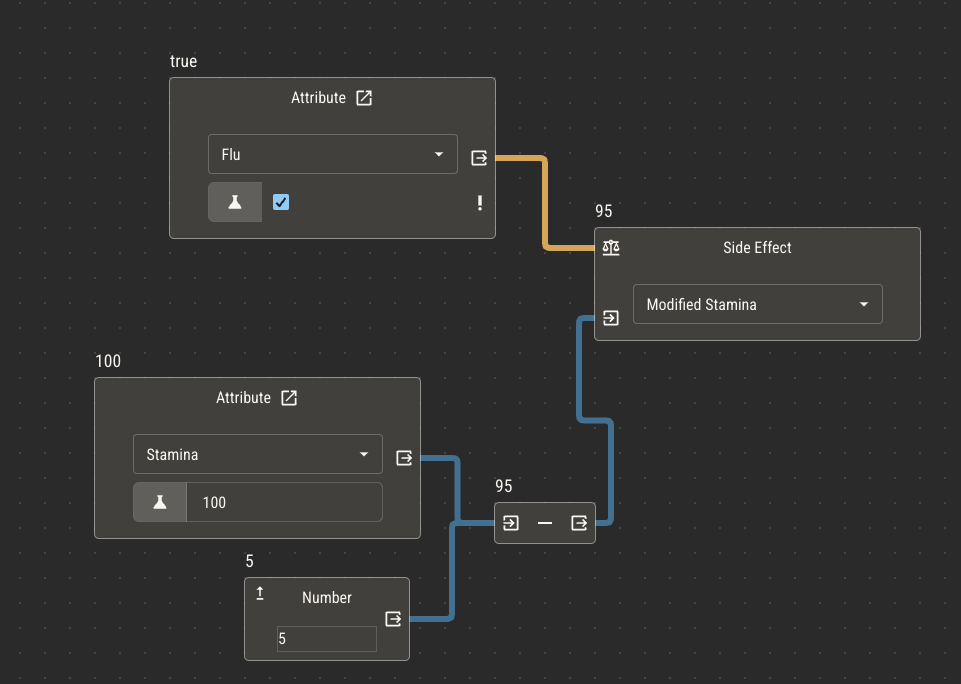

# Side Effects

When it comes time for an attribute to alter the value of _another_ attribute, you can do so by placing a side effect node in the logic of the attribute controlling the change.

Picture a game mechanic where characters can catch an illness like the flu. Characters that have the flu have their stamina reduced by 25%.

Attributes

- Stamina (controlled number)
- Flu (controlled boolean)
- Modified Stamina (derived number)

:::tip
Note the use of two attributes to represent stamina. This pattern lets players continue to control their stamina, while reading
their modified stamina as another field on their sheet.
:::

Knowing what we know about attribute logic so far, we can set up this automation within the logic of Modified Stamina.

---

Set Modified Stamina to Stamina

If Flu is true, Multiply by 0.75 (our 25% reduction)

---

This works really well and is the recommended approach for this example. However, it only works in scenarios where the value is modified stamina is directly derived from stamina and flu.

If we change the game mechanic a little, this logic will no longer work.

Say that, when a character catches the flu, their stamina is permanently reduced by 5 points until they get medical attention. Even if the flu goes away, _every time_ they catch it their
stamina continues to drop by 5 points.

In this mechanic, modified is no longer _derived_ from flu, it is _affected_ by flu. To make this effect, we need a side effect node.

Within the logic of flu, we'll add a side effect for modified stamina. This will run every time flu changes.

If flu is true, modified stamina will be the value of stamina minus 5.

:::tip
By using a side effect for this mechanic, we can optionally eliminate the modified stamina attribute altogether in favor of directly altering stamina. Whether or not you do this will depend on your
mechanics. If, for example, you need to display the values separately or add the modified points back to stamina later, you'll need separate attributes.
:::

## Take Caution not to Overuse Side Effects

You may be tempted by the simplicity of side effects to always use them. There are some downsides to doing so.

First, it makes it difficult to trace the origin of complex mechanics.

Since any attribute could alter any other as a side effect, it can be difficult to understand why
an attribute is changing if you have too many. It's much easier to see all of the relevant logic of an attribute directly in its logic editor. You can use the event log to trace the origin of attribute changes when needed.

Second, introducing bad logic is much easier to do with side effects.

For example, if an attribute changes the value of an attribute it uses to derive its _own_ value, it will never have a correct value.
This is called a circular dependency. Avoiding side effects is an easy way to avoid this in most cases.
