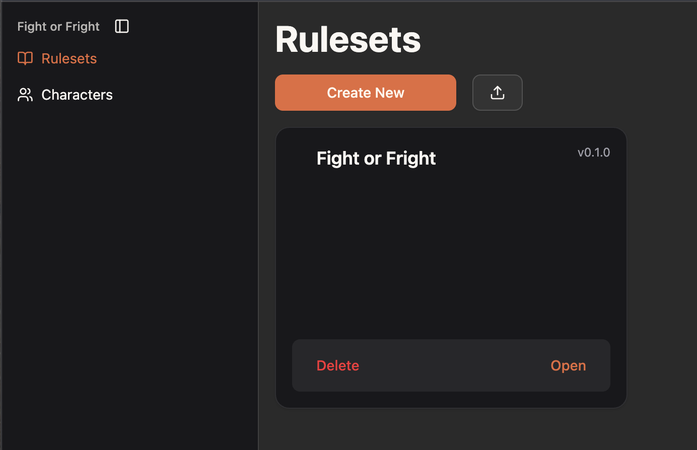

# Managing Content

All content in Quest Bound is stored on your computer directly through your browser. You can import and export Quest Bound data
as files, many of which may optionally be opened in a separate spreadsheet application and managed there.

## Import Rulesets

You can import rulesets as zip files directly from the rulesets page.

There is a similar import button on most pages, including attributes, items, actions and charts.

### Ruleset Versions

A ruleset's version is set from the ruleset settings page. Its version controls the importing behavior when you have a copy
of the imported ruleset already.

**Older Version**

If the version you're importing is older than your current version, you cannot import it. Delete your current copy
to proceed with the import.

**Same Version**

If you're importing the same version that you already have, you'll be prompted to supply a name and version number
to import it as a different ruleset. Keep in mind that this will be treated as an entirely separate ruleset. You will
not be able to migrate a character from your pre-existing ruleset to the new one.

**Newer Version**

If the version you're importing is newer, you'll be prompted to replace your current version. This will completely overwrite your
existing ruleset.

### Importing Entities to a Ruleset

An alternative to importing whole rulesets is importing its attributes, actions and items directly into an existing ruleset.

Doing so will import additively, letting you add content without replacing it. Any entities with IDs already found in your ruleset will be updated.

You can unzip a ruleset export to find the `.tsv` files to use for importing its entities.

## Export Rulesets

Export your ruleset as a zip file from the ruleset settings page. The zip file includes a README with meta data, directories with all the images
and PDF documents used in the ruleset, as well as `.tsv` files for managing attributes, items, actions and charts in a spreadsheet application like Google Sheets
or Microsoft Excel.

## Characters

Characters are created from rulesets. When a character is opened, you may build its character sheet from the set of windows available in its ruleset.

[Learn more about characters](./characters.md).
