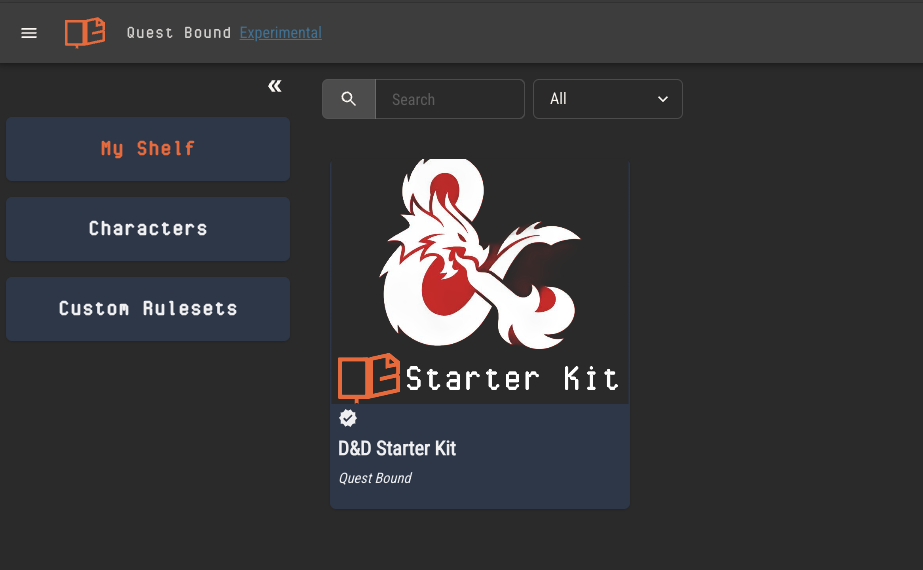

# Managing Content

## Your Shelf

Your shelf is the collection of rulesets created by others which you have purchased or to which you've been added as a player.

With these rulesets, you can create a character or add a copy to your custom rulesets.

You'll add rulesets to your shelf by visiting their published pages. Each publisher is in control of sharing those links.

## Characters

Characters are created from rulesets. When a character is opened, you may view and edit its sheet as well as view all the content from its ruleset.

[Learn more about characters](./characters.md).

:::tip
The ruleset content in the character view is always the most up to date version. That means rulebook pages, documents, charts, etc are all subject to change.

If you want to create a character from the _current_ version of that ruleset and ignore future changes, make sure to make a copy of that ruleset first, then create the
character from your copy.
:::

## Custom Rulesets

Custom rulesets are ones you create from scratch, or ones which you have copied from a ruleset on your shelf.

:::info Your copy belongs to you
Just like buying a ruleset from the store and bringing it home, you’re free to do what you’d like with any custom ruleset. Edit the pages, add archetypes, change the rules, redesign the sheet templates—changes you make to your ruleset will only be visible to you.
:::
