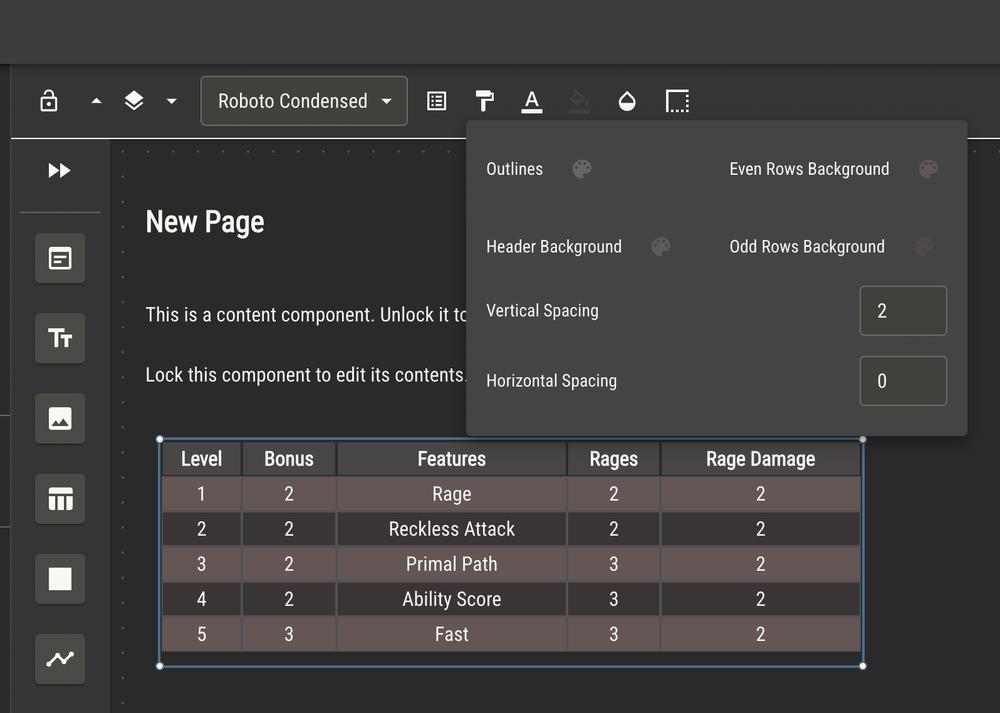

# Rulebook

The rulebook, as in all tabletop role playing games, is the method by which your game is delivered to your players. It is the primary way they’ll learn and play your game, as well as understand its art direction and lore.

While all entities in a Quest Bound ruleset will make your game more interactive for your players, the rulebook is the only requirement to deliver your game to players.

## Writing the Rules

While, arguably, the main purpose of a rulebook is to deliver the mechanics necessary to play the game, the art of a TTRPG ruleset is integral to delivering the spirit of that game.

:::note
It is Quest Bound’s position that art and exposition cary equal weight in a ruleset’s rulebook.
:::

With this in mind, writing a page in Quest Bound works differently than in similar applications. Instead of a single panel of rich text, a page is made of _many_ individual rich text windows, called content components. A page can have as many content components as needed. They can be scaled, decorated and arranged individually.

In addition to content components, other components like images, lines and shapes can be added and arranged in the same way. That means instead of adding images to rich text, you’ll place images _on top_ of content, layering and arranging it as needed.

The rulebook editor is similar in functionality to the sheet editor. Learn about how to use the editor [here](./sheet-templates.md).

## Content

Consider the below page in edit mode.

The page has two content components placed side by side, edited individually. When this page is viewed, the content isn’t shown as separated, rather just as text on the page.

Placing an image component on top of these content components will similarly blend the image into the page when viewed.

Page components can be placed with one pixel accuracy. All components have styling options that include opacity, scale, border color and offset, background color and background opacity, among others. This makes rulebook pages dynamic and customizable to your ruleset.

## Tables

Your ruleset will likely have lots of table data laying out mechanics and options. Quest Bound has a chart component specifically to make it possible to display this data without having to create tables on each page.

Read about [charts](./charts.md) to see how to upload your data sets into Quest Bound.

On a page, use a chart component to display chart data as a customizable table.

## Page Templates

Because of the way the page editor works, writing a rulebook page will take longer than it would in a simple document (we think this is a good trade). To speed up this process, you can make page templates, then create pages from them.

A page made from a template will take all components from that template, as well as default styles like background image, color palettes and default font.

A ruleset can have as many page templates as you need. You can also add page templates from [modules](./rulesets/modules) if you don’t want to create them specifically for your ruleset.

## Auto Generate Pages

Quest Bound assumes that your ruleset will need a rulebook page for each of its archetypes.

You can optionally have Quest Bound automatically create a page from a template every time you create a new archetype. Control these options in ruleset settings.

## Arranging Pages

The pages are your rulebook can be moved at any time by dragging the title of the page within the table of contents.

Pages may be nested under other pages to imply a hierarchy to your rulebook. This can be useful to separate a rulebook into chapters. Pages nested under other pages may be collapsed for better readability.

Double click a page title in the table of contents to edit it a page’s title. This can also be done in page settings.

## Linking between Pages

Text within a content component can be turned into a link using the link tool in the edit bar.

You can internally link to other rulebook pages by searching for and selecting the page title. Alternatively, you can link out to another website by providing the full url in the search bar.
