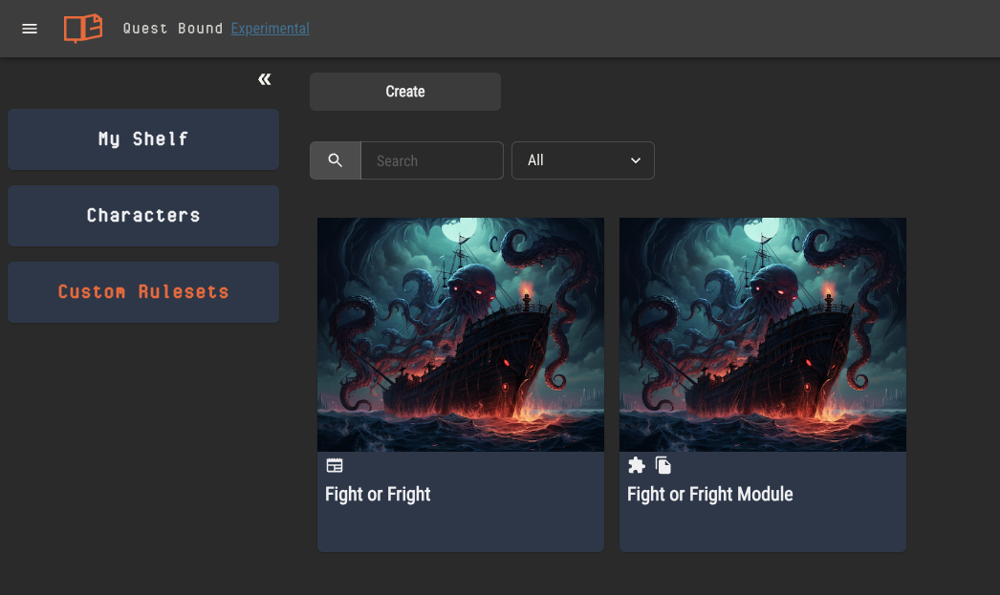

# Modules

Tabletop games are, above all else, about creativity. When you look at the rulesets on your shelf at home, chances are a few of them have loose leaf papers shoved into the back. Scrawled on these pages are the various custom monsters, items and races you’ve added to a universe created by someone else. In Quest Bound, these custom pages are called modules.

## Extending a Ruleset

There are two ways to extend the content of a ruleset on your shelf.

1. Simply open the ruleset and edit it
2. Create a module for the ruleset

### Direct Edits

When a ruleset is on your shelf in Quest Bound, it means you own a _copy_ of it. With that copy, you can directly make as many edits as you like. At any time, you can remove that ruleset from your shelf and add it again to get a fresh copy free of edits.

Anything you can do to a custom ruleset, you can do to your copy of a ruleset created by someone else. You can create custom sheet templates, edit rulebook pages, adjust the logic of attributes, etc. All of these edits will only
apply to your copy of the ruleset.

### Creating a Module

:::info
Rulesets must first be [published](./rulesets.md#publishing-rulesets) before they can be shared or have modules created from them.
:::

As a player of a TTRPG, editing a ruleset directly is probably enough customization to suite your needs. When acting as the game master, however,
you may want to share custom content you’ve made with your players so they can use _your_ sheet templates, create characters from _your_ archetypes, etc.

Creating a module of a ruleset adds a new copy of it to your shelf with a special module indicator.

Unlike rulesets added to your shelf, modules can be published and shared with other users. Modules can then be added to the ruleset it was created from, applying its custom content to the ruleset on other user's shelves.

:::caution
When a module is added to a ruleset, existing content in that ruleset will not be replaced. Only content original to the module will be added.

That means editing a ruleset’s existing content, like rulebook pages, will not have an effect when the module is added.
:::

## What can I share?

Whether you can create a module from a ruleset depends on that ruleset's creator. When a ruleset is published, the creator has an option to allow modules to be created for it.
If the creator allows it, modules may be published and shared just like rulesets.

:::info You must own the ruleset to use a module
Using modules requires that the original ruleset also be on your shelf!

As a creator, allowing module creation of your ruleset doesn't mean your content can be freely shared and replicated. Any user who intends to use a module created from your ruleset
must also have a copy of your ruleset on their shelf.
:::

### Sharing Rulesets Directly

You can alwasy directly share rulesets you've created with other users. When a ruleset has been shared with you, it will appear as an option in the "Add to Shelf" menu.

## Generic Modules

Modules don’t need to be created for a specific ruleset. Any ruleset created from scratch can be turned into a generic module.

Generic modules can be added to _any_ ruleset and are a great way to share boilerplate content at the genre level.

For example, you could create a generic module for fantasy games which includes ten character archetypes as well as their attributes. Any ruleset that adds this module will have all its content added to it, including attributes and their logic, which can be referenced in the ruleset’s sheet templates.
