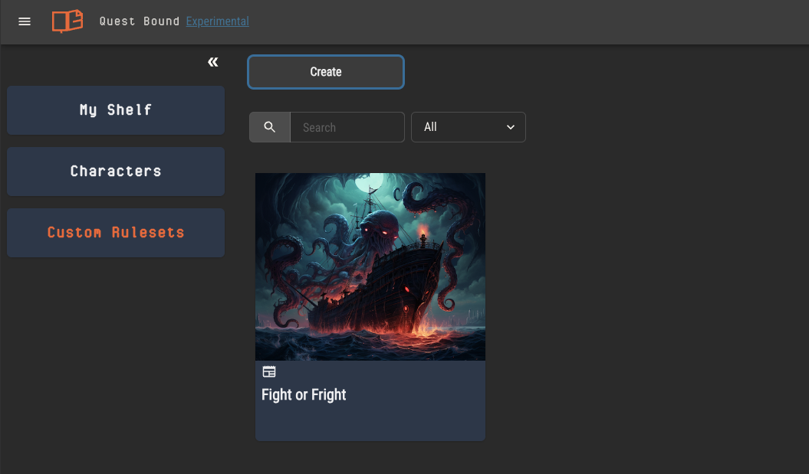

# Rulesets

Rulesets are collections of several other entities. By themselves, rulesets don’t do much. Their purpose is to bind these entities into a package that you can share with others.

Once a ruleset is opened in Quest Bound, _everything_ you see is viewed within the context of that ruleset. It is the universe of a game and there can never be more than one open at a time.

## Ruleset Entities

A ruleset is made of the following:

- [Attributes](../attributes/attributes.md)
  - The atoms of a ruleset. These are the variables that attach to all other entities
  - Stats like hit points, age, durability, skill and experience can all be represented as attributes
  - Attributes can affect and be affected by other ruleset entities through logic
- [Items](../attributes/attributes.md)
  - Objects that may be added and removed from character inventories
  - Items are built on top of attributes, may hold properties and abilities and use logic to affect other entities
- [Archetypes](../archetypes.md)
  - Collections of attributes which can have variations specific to the archetype
  - The “category” of your ruleset's characters and creatures
- [Charts](../charts.md)
  - Data sets of tabular structure, like a spreadsheet, uploaded from .csv files
  - Charts can be referenced in attribute logic or directly added to rulebook pages
- [Sheet Templates](../sheet-templates.md)
  - Provides a template for character sheets
  - Sheet templates hold fields to control a character’s attributes
  - Players may optionally choose a template to bootstrap their character sheet
- [Rulebook](../rulebook.md)
  - Binds the rules of your ruleset into a digital book
  - Pages can be nested and linked together to emulate a wiki structure

## Creating a Ruleset

You can create a new ruleset by selecting "Custom Rulesets" on the home page, then clicking the "Create" button.

You may also copy a ruleset on your shelf to build your own version of it. Copying rulesets allows you to build custom rules on top of existing games you own.

