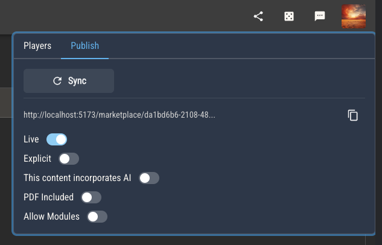

# Distributing Rulesets

After creating a ruleset in Quest Bound, you'll likely want to do a few things with it.

## Adding Players

You can add players to any of your custom rulesets. Players will be able to create a character, allowing them to view the rulebook, documents and charts as well as use any of the attached sheet templates. They will also be able to edit their character sheet using the sheet editor, giving them access to your ruleset's attributes and automations.

## Publishing

Any content you create may be published.

Once a ruleset has been published, you will receive a link to its marketplace page. Published rulesets are versioned, so you can continue to build your ruleset after it's been published without affecting the available copy. You may sync the working copy
with the published version at any time.

A few options are available to let your customers know the following:

- If they can create and publish modules for this ruleset
- If any of its content used generative AI
- If it comes with a PDF version of the rulebook (available via its documents)
- If it contains explicit content
