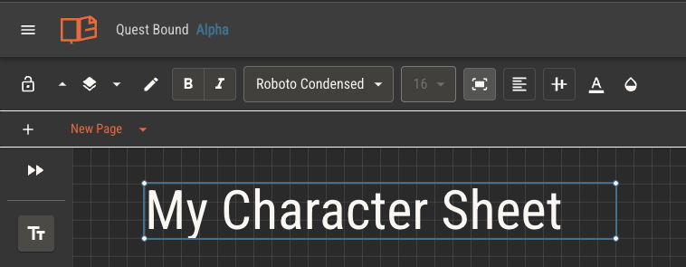

# Sheet Templates

When a player creates a character from your ruleset, they'll choose an included sheet template, creating a copy of it for that character. Sheets are used to control a character's attributes and to provide players
an area for tracking their game.

Using a custom sheet is not a requirement. Every character will include a simple sheet by default, which will be populated with all of a character's attributes.

:::info You can freely edit your own character sheet
Your character gets a copy of the sheet template it was created from. You can edit this using the same editor used for template creation for complete control over your character's sheet.
:::

## Creating a Sheet Template

Quest Bound's sheet editor lets you build sheets from scratch by placing individual components in a drag and drop interface. Each component can be placed with 1 pixel precision and can be scaled to any size.

When a sheet is viewed, components will stay in their relative positions. Depending on the size of the device, it will overflow horizontally and vertically to the edge of the farthest placed components. Players will be able to scroll to view the entire sheet.

Your ruleset can have as many sheet templates as needed. Characters will always have one character sheet, but they can recreate it by selecting a different template at any time. The character's attribute values will carry between sheets.

## Sheet Settings

Access a sheet's settings from the settings menu under the sheet's title.

You can add a default font to your sheet, which will be used for all text components.

Add up to twelve colors to a sheet's palette. All color pickers will show swatches of its palette for easy selection.

Set a background image and opacity to your sheet to cover the entire sheet. This is useful for adding a background texture or pattern.

Select a grid pattern of square, dots or none to help with component placement.

Toggle snap to grid to place components at 20px or 1px intervals.

## Tabs

Sheets can have as many tabs as needed. Tabs can be used to organize a sheet into separate pages for better usability.

Add a tab by clicking the plus button in the tab bar. Tabs can be reordered by dragging them left or right. Rename or delete tabs from the dropdown menu next to each tab title.

## Sheet Editor Canvas

### Shortcuts and Controls

View the list of keyboard controls [here](./key-bindings).

### Placing Components

Place a component by dragging it out from the component panel on the left.

Components may be placed anywhere on the sheet editor canvas, which is rendered in a grid pattern by default.

If a component is moved such that any part of it is not on the canvas, it will return to its previous position.

### Panning

The canvas may be panned in vertical and horizontal directions, providing more area to place components. When a sheet is viewed by a player, it will be just large enough to fit all its components, plus a small area of padding. Anything
not visible on the player's device will overflow and be reachable by scrolling.

Move the canvas by either scrolling or holding the right or middle mouse buttons and moving the mouse. In the bottom right corner of the canvas, the current X and Y position are displayed alongside a button to reset.

The canvas coordinates represent the top left corner of the sheet. When the sheet editor is opened, the top left corner will be set to 0,0. It is not possible to move the canvas to negative coordinates in either direction.

### Selecting Components

Clicking a single component will select it. Selected components are outlined in blue and will have options to edit and scale them.

Hold shift while clicking to select multiple components. You can also click and drag to select multiple components at once.

When multiple components are selected, there will be an option to group them in the toolbar. Grouped components will be moved and edited together.

### Deleting Components

Selected components may be deleted by using the Backspace or Delete keys. You may also open the context menu of a component by right clicking on it, then selecing the delete option.

You may undo the deletion of components with the undo action.

### Undo and Redo

The last several component updates are stored in the editor's history. This includes creating, moving, styling, scaling and deleting components.

Right click on the canvas to open a menu with undo and redo options. If a history is available, you'll be able to move through it with these options.

You can also use the common keyboard shortcuts. `Ctrl + Z` to undo and `Ctrl + Shift + Z` to redo on Windows, and `Cmd + Z` and `Cmd + Shift + Z` on Mac.

### Copy and Paste

Components may be copied and pasted for faster editing. Right click on a component for copy and cut options. Copy will copy the component the the editor's clipboard. Clip will copy it and delete the original. If multiple
components are selected, they will all be copied.

The entire component, including context, style and scale will be copied.

Right click on the canvas for an option to paste the copied component. Single components will be placed near your mouse, while multiple will be placed near their originals.

If one or more components are selected, you can use keyboard shortcuts to copy and paste them. `Ctrl + C` to copy, `Ctrl + X` to cut, and `Ctrl + V` to paste on Windows. `Cmd + C` to copy, `Cmd + X` to cut, and `Cmd + V` to paste on Mac.

## Common Editing Options

### Colors

All components have options to set background, text (if applicable) and border colors. Colors can be set with a color picker or by entering a hex value.

Background color includes an alpha channel to adjust background transparency.

:::tip
Background transparency is different than opacity.

Adjust opacity to fade the entire component. Adjust background transparency to fade only the background, leaving the other content visible.
:::

### Borders

Most components have border options. You can set the color, width and offset of borders. Offset will move the border inwards or outwards from the component's edge.

Each corner of a component can have its own border radius, allowing you to create rounded corners.

### Opacity

Controls have visible a component is, between 0% and 100%. This is usefuly for background images and containers.

### Layer

Controls the order in which components are layered on top of each other. Components with a higher layer value will be placed on top of components with a lower layer value.

You can move a component up or down using the arrows, or you can see all components which intersect with the selected component by clicking the layer button itself.

### Lock

Locking a component will prevent it from being moved or edited. Once a component is placed and styled, locking it will make adjusting the rest of the sheet easier.

Locking an image component will prevent the image from being changed by the player during play.

### Conditional Render

Any component may be set to rendner _only if_ a given boolean attribute is true or false. By layering components, you can set up complex, dynamic sheets
which change based on the state of the character.

## Component Types

### Text

Static text to be displayed on the sheet. Text components represent text that is not intended to be changed by the player during play.

Headers, labels, short descriptions and branding are all good candidates for text components.

Text components can use [text replacement](./attributes/controlling-attributes#text-replacement) to read values from the character, such as name and attribute values.

### Input

Provides a field of either text or a number that the player can edit during play.

Input components can be assigned [attributes](./attributes/controlling-attributes.md) to give players control over their character's attributes.

Input components can be set to either text or number type. While both types can be used to store numbers, number type inputs will only accept numbers and will respond
to arrow keys.

### Image

Displays an image on the sheet. Images may be added to your gallery by uploading or setting the url of a hosted image. Image components which display a gif will be animated.

When creating a character, players will have an option to upload an image. Image components can reference a character's image by default by selecting the option in the image component's toolbar.

If your sheet needs a background image, apply one from sheet settings instead of using an image component. This will cover the entire sheet and will be easier to manage.

:::tip
While it is possible to achieve minimally designed sheets using only the native tools in the sheet editor, sheets with intricate art styles will benefit from uploading design assets as image components.

Images may be layered among other components with varying color and opacity to achieve complex designs.
:::

### Frame

Frame components let you embed external websites directly into your character sheets and rulebook pages. Add a url and lock this component to display the external site.

Frame components render an [iframe](https://developer.mozilla.org/en-US/docs/Web/HTML/Element/iframe), giving this component its own browser context. Because of this, some click events within the component might be blocked while it's active.

Note that browser local storage is shared. If you embed a site that uses local storage, those values will be stored within Quest Bound for later use.

Not all websites allow for this kind of rendering. If a site does not provide the proper `X-Frame-Options` header, it will not work within a frame component.

:::caution
Every time a character sheet or rulebook page is displayed, frame components will start a new browser context. This means certain features, like streaming sheets, might not work as expected.
:::

### Checkbox

Provides an input for players to toggle on and off.

Checkbox components can be assigned [attributes](./attributes/controlling-attributes) to give players control over their character's [boolean type attributes](./attributes#types-of-attributes).

Checkboxes have two default styles, but you can also set any two images to represent the checked and unchecked states.

### Shape

Shapes are a simple component to add visual distinction to areas of your sheets. They are useful for applying background colors and containers.

### Line

A line component starts as a single point that can be placed on the sheet. You can add additional points to created a segmented line, which can then be arranged into borders.

### Polygons

You can make polygons with either the Shape or Line components.

By changing the number of sides in the Shape component, you can make regular polygons. Note that these
polygons will always have sides of equal length determined by the width of the component.

The line component can support irregular polygons by selecting the fill shape option. Each line component will dictate a vertex in the polygon, making the length of each side fully adjustable.

### Graph

Graph components can be used to visually demonstrate the percentage of a given attribute's value over its maximum value. Alternatively, you may assign a separate attribute as the maximum value for the percentage calculation.

Graph components may fill horizontally, vertically or radially. Set the component's background color as the empty color, and font color as the fill.

You can inverse the fill of a graph component to move in the opposite direction, giving the appearance of filling instead of draining as an attribute's value increases.

:::caution
Graph components _must_ have attributes assigned to them. Without an attribute, a graph component will always display at 10%.
:::

### Canvas

The canvas provides players with an area for freehand drawing. When a sheet is viewed, the canvas can be zoomed and panned infinitely and has options for drawing in various colors, as well
as selecting and scaling the drawings.

The canvas is useful for providing areas of your sheet for players to draw maps, diagrams or other illustrations.

### Notes

The notes component gives players an area of text to write notes. Various font styles and formats are available.

