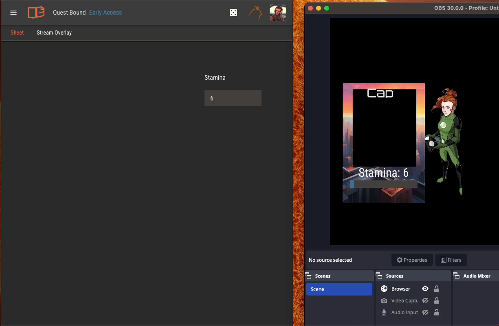

# Streaming a Character Sheet

You can broadcast a single tab of any character sheet to a separate page. This page can be viewed by anyone without logging into Quest Bound.

The stream link for a given character is `https://questbound.com/stream/<character ID>`. You can find this in the character's sheet settings page.

To disable streaming for a character, select "None" in the stream tab options drop down.

Stream pages update in near real time as the character is updated, either from the character sheet or simple sheet. Updates to the layout of the stream tab
will appear within a few seconds.

## Streaming in OBS

You can render a character's stream tab in OBS by creating a new browser source and placing the stream link in the URL field.

Using the default settings will make the background of the stream page transparent, or you can enter these settings in the Custom CSS field.

`body { background-color: rgba(0, 0, 0, 0); margin: 0px auto; overflow: hidden; }`

